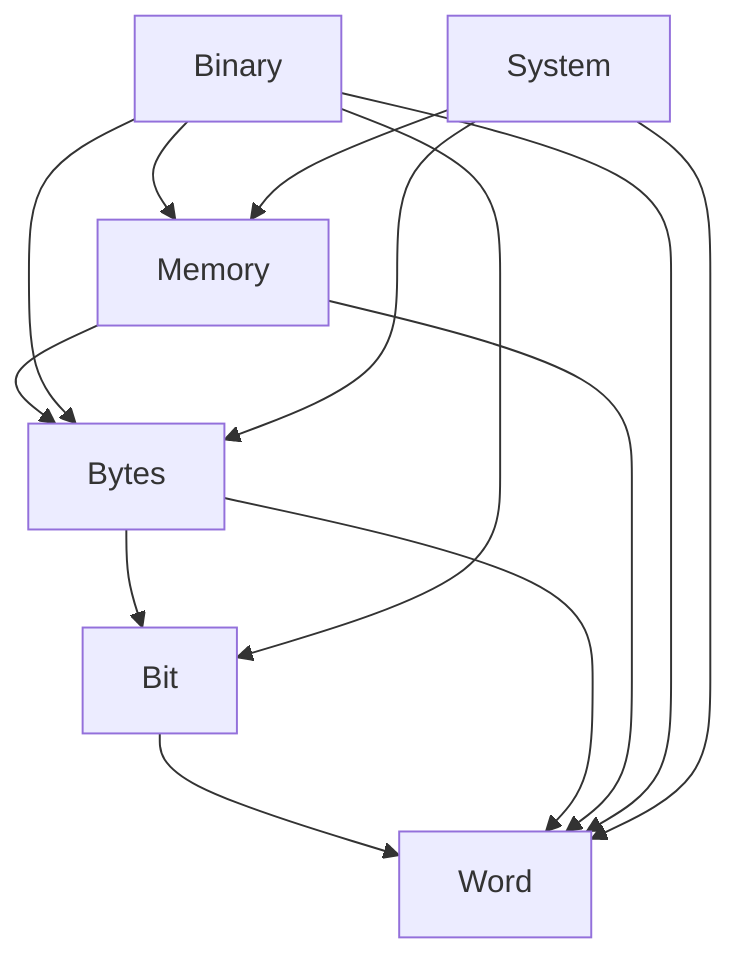

# Architecture

Version: 0.1.0-draft
Last updated: 2026-03-07

## 1. Overview

Radix is a formally verified low-level systems programming library for Lean4.

Lean4 is a dependently-typed programming language with a powerful proof system
(Mathlib), but it lacks the low-level primitives necessary for systems programming:
signed fixed-width integers, controlled overflow arithmetic, bit manipulation,
memory layout control, binary serialization, and OS interfaces.

Radix provides these primitives with Mathlib-grade formal proofs of correctness.

## 2. Three-Layer Architecture

```
+-------------------------------------------------------------+
|  Layer 3: Verified Specification                             |
|  Pure mathematical definitions and theorems.                 |
|  No executable code -- only specifications and proofs.       |
|                                                              |
|  "What does correct behavior mean?"                          |
+-------------------------------------------------------------+
|  Layer 2: Verified Implementation                            |
|  Pure Lean4 implementations proven to satisfy Layer 3 specs. |
|  Computable functions with attached correctness proofs.      |
|                                                              |
|  "An implementation that is provably correct."               |
+-------------------------------------------------------------+
|  Layer 1: System Bridge                                      |
|  Wrappers around Lean4 built-in IO APIs (pure Lean4).        |
|  Strictly Pure Lean 4 and Built-in IO Policy.       |
|                                                              |
+-------------------------------------------------------------+
|  Hardware / Operating System (via Lean4 runtime)             |
+-------------------------------------------------------------+
```

### Design Rationale

This architecture is inspired by:
- **F*/Low***: Verified high-level code extracted to C
- **seL4**: Functional specification refined to C implementation
- **CertiKOS**: Certified Abstraction Layers

The key insight: maximize the verified portion, minimize the trusted portion.

Layer 1 MUST use Lean4's built-in IO APIs (IO.FS, IO.Process, etc.) exclusively.

### Strict Pure Lean 4 and Built-in IO Policy

Radix STRICTLY PROHIBITS the use of handwritten C code, FFI bindings, and @[extern] calls to custom C ABI shims. This is an absolute necessity to prevent memory leaks, UAF vulnerabilities, and FD recycling issues arising from imperfect interaction with the Lean runtime. All interactions with the underlying hardware, operating system, and file system MUST be implemented securely using Lean 4's built-in IO libraries.
By omitting any custom C layer, the project ensures the highest degree of safety and formal verifiability.

Layers 2-3 contain all the intellectual value: proofs that the operations
are correct, and implementations that provably satisfy those specifications.

### Layer Interaction Rules

1. Layer 3 (Spec) MUST NOT import Layer 2 or Layer 1
2. Layer 2 (Impl) MUST import Layer 3 (to prove conformance to specs)
3. Layer 2 (Impl) MUST NOT import Layer 1 (pure computation, no IO)
4. Layer 1 (Bridge) MUST import Layer 3 (to state which spec it implements)
5. Layer 1 (Bridge) MAY import Layer 2 (to reuse verified pure logic)

User code imports:
- Layer 2 for pure verified computation (Word, Bit, Bytes, Memory, Binary)
- Layer 1 for effectful OS operations (System)
- Layer 3 for reasoning and proof

### How Each Module Maps to Layers

| Module | Layer 3 (Spec) | Layer 2 (Impl) | Layer 1 (Bridge) |
|--------|---------------|----------------|-----------------|
| Word   | Word.Spec     | Word.UInt, Word.Int, Word.Arith, Word.Conv | -- |
| Bit    | Bit.Spec      | Bit.Ops, Bit.Scan, Bit.Field | -- |
| Bytes  | Bytes.Spec    | Bytes.Order, Bytes.Slice | -- |
| Memory | Memory.Spec   | Memory.Model, Memory.Ptr, Memory.Layout | -- |
| Binary | Binary.Spec   | Binary.Format, Binary.Parser, Binary.Serial | -- |
| System | System.Spec   | System.Error, System.FD | System.IO, System.Assumptions |

Modules Word through Binary are **pure** -- they live entirely in Layers 2-3.
System is the **only** module that has a Layer 1 component.

### Radix.System.Assumptions

`Radix/System/Assumptions.lean` is a **dedicated Layer 1 module** containing
all named trusted assumptions (`axiom` declarations prefixed with `trust_`).

**Why `axiom`, not `opaque`?**

Lean 4's `opaque` requires a concrete definition body -- it merely hides the
definition from the reducer. It is NOT suitable for asserting propositions
that cannot be proven within Lean's type system (e.g., "the OS `read` syscall
obeys POSIX semantics"). Such propositions require `axiom`, which introduces
a declaration without a proof term.

These axioms are **explicitly permitted by C-004a** as the sole exception to
the no-custom-axioms rule: they assert properties of the external world
(OS behavior, hardware semantics), not mathematical truths. They are tracked
in the TCB and audited on every release (see Section 5).

Rules:
- System.IO MUST import System.Assumptions
- System.Assumptions MUST import System.Spec (to reference the specs it assumes)
- System.Assumptions MUST NOT import any Layer 2 module
- No module outside Radix.System MAY import System.Assumptions
- Every `axiom` declaration MUST have a docstring citing the POSIX or Lean4
  runtime spec that justifies the assumption
- This file is the **primary TCB audit target** for Radix releases
- Each `axiom` MUST be prefixed with `trust_` and typed as a proposition
  (e.g., `axiom trust_read_posix_semantics : ReadSatisfiesSpec`)

### Call Flow Example: Reading a File

```
User code
  |
  v
Radix.System.IO  (Layer 1: wraps Lean4 IO.FS.Handle)
  |  imports
  v
Radix.System.Spec (Layer 3: defines what "read" means abstractly)
  |  also uses
  v
Radix.Bytes.Slice (Layer 2: verified byte slice manipulation)
  |  imports
  v
Radix.Bytes.Spec  (Layer 3: byte operation specifications)
```

1. `System.Spec` defines the abstract model: pre/postconditions for `read`
2. `System.IO` wraps `IO.FS.Handle.read` with Radix types and error handling
3. `System.IO` declares **named trusted assumptions** (`axiom` declarations)
   stating that Lean4's IO implementation satisfies `System.Spec`. These are
   `axiom` declarations with docstrings explaining the trust rationale.
   See C-004a for the policy governing these assumptions.
4. The returned `ByteSlice` is a verified Layer 2 value -- pure proofs apply

The trust boundary is: "Lean4's IO.FS.Handle.read behaves as POSIX read."
This is NOT proven -- it is a named trusted assumption about Lean4's runtime.
It is documented, auditable, and explicitly outside Radix's proof obligations.

## 3. Module Architecture

```
Radix
 |
 +-- Radix.Word              -- Fixed-width integer types and arithmetic
 |    +-- Radix.Word.Spec    -- [Layer 3] Specifications for word operations
 |    +-- Radix.Word.UInt    -- [Layer 2] Unsigned integers (UInt8..UInt64, USize)
 |    +-- Radix.Word.Int     -- [Layer 2] Signed integers (Int8..Int64, ISize)
 |    +-- Radix.Word.Size    -- [Layer 2] Platform-sized types (USize, ISize)
 |    +-- Radix.Word.Arith   -- [Layer 2] Wrapping/Saturating/Checked arithmetic
 |    +-- Radix.Word.Conv    -- [Layer 2] Conversions between widths, signed/unsigned
 |    +-- Radix.Word.Lemmas  -- [Layer 3] Algebraic properties and proofs
 |
 +-- Radix.Bit               -- Bit-level operations
 |    +-- Radix.Bit.Spec     -- [Layer 3] Specifications for bit operations
 |    +-- Radix.Bit.Ops      -- [Layer 2] AND, OR, XOR, NOT, shifts, rotates
 |    +-- Radix.Bit.Scan     -- [Layer 2] clz, ctz, popcount, bitReverse
 |    +-- Radix.Bit.Field    -- [Layer 2] Bit field extraction and insertion
 |    +-- Radix.Bit.Lemmas   -- [Layer 3] Bitwise algebra proofs
 |
 +-- Radix.Bytes             -- Byte-order operations
 |    +-- Radix.Bytes.Spec   -- [Layer 3] Specifications for byte operations
 |    +-- Radix.Bytes.Order  -- [Layer 2] Endianness conversions
 |    +-- Radix.Bytes.Slice  -- [Layer 2] Bounds-checked ByteArray views
 |    +-- Radix.Bytes.Lemmas -- [Layer 3] Round-trip proofs
 |
 +-- Radix.Memory            -- Abstract memory model
 |    +-- Radix.Memory.Spec    -- [Layer 3] Memory model specifications
 |    +-- Radix.Memory.Model   -- [Layer 2] Memory region abstraction
 |    +-- Radix.Memory.Ptr     -- [Layer 2] Pointer abstraction with provenance
 |    +-- Radix.Memory.Layout  -- [Layer 2] Packed struct layout computation
 |    +-- Radix.Memory.Lemmas  -- [Layer 3] Memory safety proofs
 |
 +-- Radix.Binary            -- Binary format DSL
 |    +-- Radix.Binary.Spec    -- [Layer 3] Format correctness specifications
 |    +-- Radix.Binary.Format  -- [Layer 2] Format description types
 |    +-- Radix.Binary.Parser  -- [Layer 2] Verified parser generation
 |    +-- Radix.Binary.Serial  -- [Layer 2] Verified serializer generation
 |    +-- Radix.Binary.Lemmas  -- [Layer 3] Round-trip (parser . serial = id) proofs
 |
 +-- Radix.System            -- System call interface
      +-- Radix.System.Spec        -- [Layer 3] Abstract POSIX model
      +-- Radix.System.Error       -- [Layer 2] Error code modeling (pure)
      +-- Radix.System.FD          -- [Layer 2] File descriptor abstraction (pure types)
      +-- Radix.System.IO          -- [Layer 1] Wrappers around Lean4 IO (pure Lean4)
      +-- Radix.System.Assumptions -- [Layer 1] Named trusted assumptions (TCB audit target)
```

### Module Dependency Graph



Dependencies flow downward. Word is the foundational module with no
internal dependencies. Each higher module builds on lower ones.

## 4. Relationship with Lean4 Built-ins and Mathlib

### Lean4 Built-in Types

Lean4 provides `UInt8`, `UInt16`, `UInt32`, `UInt64`, `USize` as built-in types.
These are opaque types compiled to C uint types.

Radix's approach:
- **Wrap, don't replace.** Radix types build on Lean4's built-in types where possible.
- **Extend.** Radix adds signed variants, additional arithmetic modes, and proofs.
- **Bridge.** Radix provides `toBuiltin` / `fromBuiltin` conversions.

### Mathlib

Mathlib is a formally verified library -- all its code carries proofs.
Using Mathlib does NOT expand the TCB. Radix MAY depend on Mathlib freely.

Mathlib provides `BitVec n` with some bitwise operations and proofs.

Radix's approach:
- **Build on BitVec** for the specification layer (Layer 3)
- **Leverage Mathlib's algebraic hierarchy** (groups, rings, etc.) for proof structure
- **Provide efficient implementations** in Layer 2 that are proven equivalent
- **Extend** with operations Mathlib doesn't provide (bit scanning, rotates, etc.)

## 5. Trusted Computing Base (TCB) Analysis

The TCB is the set of components whose correctness is **assumed, not proven**.
In Radix, the TCB consists of:

1. **Lean4 compiler and runtime** -- outside Radix's control.
   This includes the C runtime that Lean4 compiles to.
2. **Lean4's built-in IO implementation** -- when Radix wraps `IO.FS`,
   `IO.Process`, etc., it assumes they behave per POSIX semantics.
   This assumption is documented via named trusted assumptions (see C-004a).
3. **Lean4's default axioms** -- `propext`, `Quot.sound`, `Classical.choice`.
   each is individually justified and part of the TCB.
   6. **Named trusted assumptions in Radix.System.Assumptions** -- `axiom`
   declarations asserting that (2), (4), and (5) satisfy `System.Spec`.
   These are the sole exception to C-004's no-custom-axioms rule;
   they assert properties of the external world, not mathematical truths.

The following are explicitly **NOT** part of the TCB:

- **Mathlib** -- formally verified; trusted by proof, not by faith.
- **Radix Layers 2-3** -- all code with attached proofs is verified.
- **Radix Layer 1 logic** -- Lean4 code in System.IO that calls Lean4 IO
  APIs is verified Lean4 code. Only the *assumption that the underlying
  IO behaves correctly* is in the TCB, not the wrapping logic itself.

### TCB Audit Inventory

Every release MUST include a TCB audit document listing:
- All `trust_*` axiom declarations (file, line, what is assumed)
- Total count of each category
- The Lean4 toolchain version (since the runtime is in the TCB)

### Minimizing the TCB: Pure Lean4 Strategy


Lean4 already provides some OS interfaces through its runtime:
- `IO.FS.readFile`, `IO.FS.writeFile`, `IO.FS.Handle` (file I/O)
- `IO.Process` (process management)
- `Socket` (via lean4-socket or similar pure Lean4 libraries)

Radix's System module SHOULD:
1. **Prefer Lean4's built-in IO APIs** over raw FFI
2. **Wrap Lean4 IO APIs** with stronger types and formal models
   (e.g., `mmap`, `mprotect`, specific `ioctl` calls)


## 6. Build and Project Structure

```
radix/
  lakefile.lean             -- Lake build configuration
  lean-toolchain            -- Lean4 version pin
  Radix.lean                -- Root import
  Radix/
    Word.lean
    Word/
      UInt.lean
      Int.lean
      ...
    Bit.lean
    Bit/
      ...
    ...
  examples/
    ...
  benchmarks/
    results/                -- Performance measurement results
  docs/
    ...
  TODO.md
  CHANGELOG.md
  LICENSE
```

The project uses Lean4's Lake build system.
Mathlib is a dependency specified in lakefile.lean.
