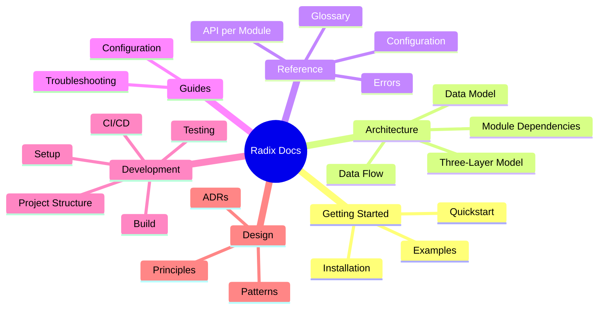

# Radix Documentation

Welcome to the Radix documentation. This is the central navigation hub for all project documentation.

## Quick Links

| I want to... | Go to |
|---|---|
| Get started quickly | [Quickstart](getting-started/quickstart.md) |
| Understand the architecture | [Architecture Overview](architecture/) |
| Look up an API | [API Reference](reference/api/) |
| Configure the project | [Configuration Guide](guides/configuration.md) |
| Set up for development | [Dev Setup](development/setup.md) |
| Understand a design decision | [ADRs](design/adr.md) |

## Documentation Map

## All Documents

### Getting Started
| Document | Audience | Description |
|----------|----------|-------------|
| [Installation](getting-started/installation.md) | Users | All installation methods |
| [Quickstart](getting-started/quickstart.md) | Users | Get running in 5 minutes |
| [Examples](getting-started/examples.md) | Users/Devs | Curated code examples |

### Architecture
| Document | Audience | Description |
|----------|----------|-------------|
| [Overview](architecture/README.md) | All | Three-layer architecture and high-level system design |
| [Components](architecture/components.md) | Devs | Internal component breakdown (18 leaf modules) |
| [Data Model](architecture/data-model.md) | Devs | Core data structures and BitVec relationships |
| [Data Flow](architecture/data-flow.md) | Devs | How data moves between layers and modules |
| [Module Dependencies](architecture/module-dependency.md) | Devs | Module dependency graph |

### Reference
| Document | Audience | Description |
|----------|----------|-------------|
| [API Reference](reference/api/) | Devs | Complete API docs per module |
| [Configuration](reference/configuration.md) | Users/Ops | lakefile.lean and toolchain options |
| [Glossary](reference/glossary.md) | All | Domain terminology |
| [Errors](reference/errors.md) | All | Error types and resolutions |

### Guides
| Document | Audience | Description |
|----------|----------|-------------|
| [Configuration](guides/configuration.md) | Users | How to configure Radix as a dependency |
| [Troubleshooting](guides/troubleshooting.md) | All | Common problems and fixes |

### Development
| Document | Audience | Description |
|----------|----------|-------------|
| [Dev Setup](development/setup.md) | Contributors | Environment setup |
| [Build](development/build.md) | Contributors | Build system guide |
| [Testing](development/testing.md) | Contributors | Test strategy and execution |
| [Project Structure](development/project-structure.md) | Contributors | Codebase navigation |

### Design
| Document | Audience | Description |
|----------|----------|-------------|
| [Principles](design/principles.md) | All | Design philosophy |
| [Patterns](design/patterns.md) | Devs | Patterns used and rationale |
| [ADRs](design/adr.md) | All | Architecture Decision Records summary |

## See Also

- [日本語ドキュメント](../ja/) — Japanese documentation
- [Design Docs](design/) — Design principles, patterns, and ADRs
- [CHANGELOG](../../CHANGELOG.md) — Version history
