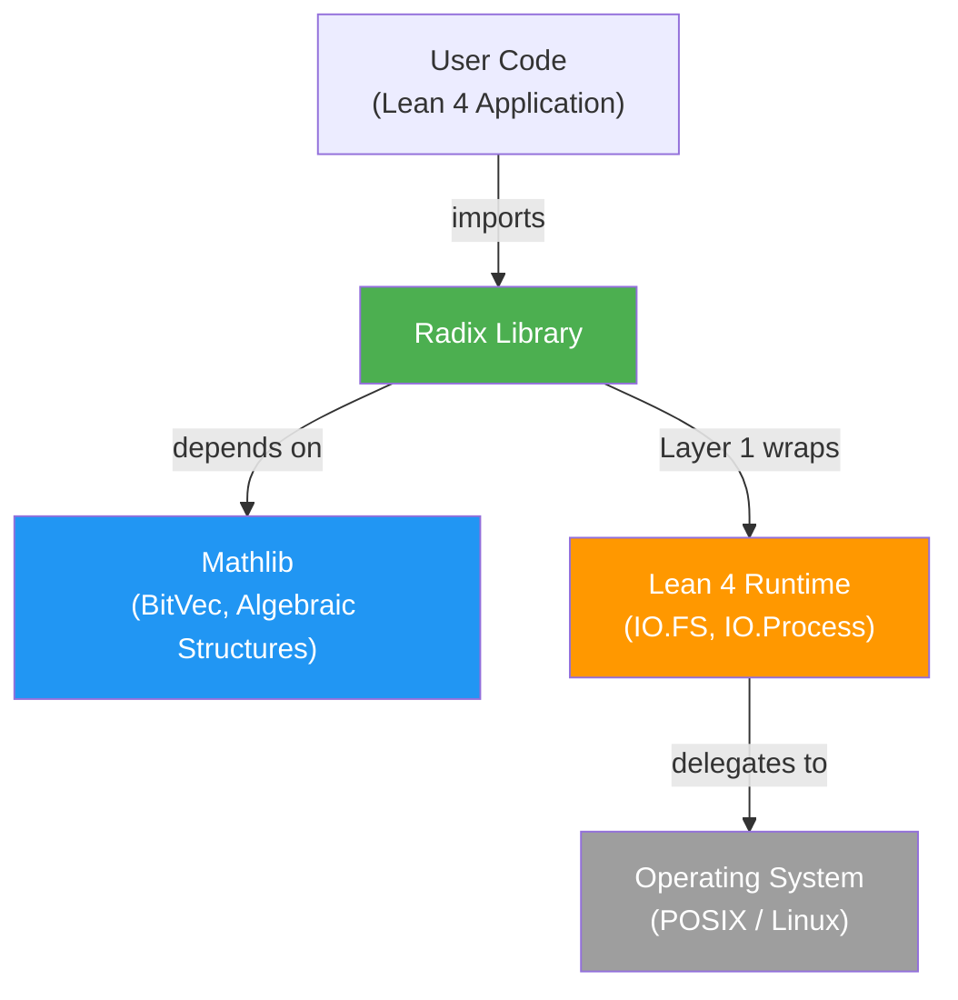
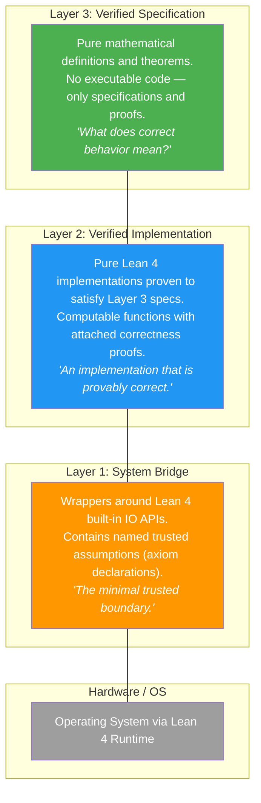
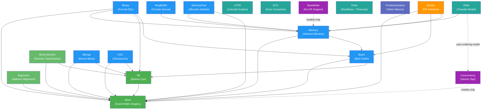

# Architecture Overview

> **Audience**: Developers, Architects, Contributors

## System Context

Radix is a formally verified low-level systems programming library for Lean 4. It provides C-equivalent capabilities — fixed-width integers, bitwise operations, byte order conversions, memory abstractions, binary format DSL, system I/O, concurrency models, and bare-metal support — all with Mathlib-grade formal proofs.

## Three-Layer Architecture

Radix adopts a three-layer architecture inspired by seL4, CertiKOS, and F*/Low*:

### Layer Interaction Rules

1. Layer 3 (Spec) **MUST NOT** import Layers 2 or 1
2. Layer 2 (Impl) **MUST** import Layer 3 (to prove conformance to specs)
3. Layer 2 (Impl) **MUST NOT** import Layer 1 (pure computation, no IO)
4. Layer 1 (Bridge) **MUST** import Layer 3 (to state which spec it implements)
5. Layer 1 (Bridge) **MAY** import Layer 2 (to reuse verified pure logic)

### How Each Module Maps to Layers

| Module | Layer 3 (Spec) | Layer 2 (Impl) | Layer 1 (Bridge) |
|--------|---------------|----------------|-----------------|
| Word | `Word.Spec`, `Word.Lemmas.*` | `Word.UInt`, `Word.Int`, `Word.Arith`, `Word.Conv`, `Word.Size`, `Word.Numeric` | — |
| Bit | `Bit.Spec` | `Bit.Ops`, `Bit.Scan`, `Bit.Field` | — |
| Bytes | `Bytes.Spec` | `Bytes.Order`, `Bytes.Slice` | — |
| Memory | `Memory.Spec` | `Memory.Model`, `Memory.Ptr`, `Memory.Layout` | — |
| Binary | `Binary.Spec`, `Leb128.Spec` | `Binary.Format`, `Binary.Parser`, `Binary.Serial`, `Leb128` | — |
| System | `System.Spec` | `System.Error`, `System.FD` | `System.IO`, `System.Assumptions` |
| Concurrency | `Concurrency.Spec` | `Concurrency.Ordering`, `Concurrency.Atomic` | `Concurrency.Assumptions` |
| BareMetal | `BareMetal.Spec` | `BareMetal.GCFree`, `BareMetal.Linker`, `BareMetal.Startup` | `BareMetal.Assumptions` |
| Alignment | `Alignment.Spec`, `Alignment.Lemmas` | `Alignment.Ops` | — |
| RingBuffer | `RingBuffer.Spec`, `RingBuffer.Lemmas` | `RingBuffer.Impl` | — |
| Bitmap | `Bitmap.Spec`, `Bitmap.Lemmas` | `Bitmap.Ops` | — |
| CRC | `CRC.Spec`, `CRC.Lemmas` | `CRC.Ops` | — |
| MemoryPool | `MemoryPool.Spec`, `MemoryPool.Lemmas` | `MemoryPool.Model` | — |
| UTF8 | `UTF8.Spec`, `UTF8.Lemmas` | `UTF8.Ops` | — |
| ECC | `ECC.Spec`, `ECC.Lemmas` | `ECC.Ops` | — |
| DMA | `DMA.Spec`, `DMA.Lemmas` | `DMA.Ops` | — |
| Timer | `Timer.Spec`, `Timer.Lemmas` | `Timer.Ops` | — |
| ProofAutomation | — | — | Meta-level tactic macros |

> **Note:** Fourteen modules are fully pure in v0.3.0: Word, Bit, Bytes, Memory, Binary, Alignment, RingBuffer, Bitmap, CRC, MemoryPool, UTF8, ECC, DMA, and Timer. Only System, Concurrency, and BareMetal cross the Layer 1 trusted boundary, while `ProofAutomation` remains a meta-level support module. This split is also exposed directly in the import surface as `Radix.Pure` and `Radix.Trusted`.

## Module Dependency Graph

Dependencies still flow upward from `Word`, but the current release now includes two extension layers: the v0.2.0 data-structure cluster (`Alignment`, `RingBuffer`, `Bitmap`, `CRC`, `MemoryPool`, and `Word.Numeric`) and the v0.3.0 composable cluster (`UTF8`, `ECC`, `DMA`, and `Timer`). Region algebra extends `Memory`, and `ProofAutomation` provides meta-level proof helpers outside the runtime layer stack.

## Trusted Computing Base (TCB)

The TCB is the set of components whose correctness is **assumed, not proven**:

| Component | Status |
|-----------|--------|
| Lean 4 compiler and runtime | Accepted as platform |
| Lean 4's built-in IO implementation | Trusted via named axioms |
| Lean 4's default axioms (`propext`, `Quot.sound`, `Classical.choice`) | Standard |
| `trust_*` axioms in `System.Assumptions` | Audited per release |
| `trust_*` axioms in `Concurrency.Assumptions` | Audited per release |
| `trust_*` axioms in `BareMetal.Assumptions` | Audited per release |

**Explicitly NOT in the TCB:**
- Mathlib (formally verified)
- Radix Layers 2–3 (proven)
- Radix Layer 1 Lean 4 code (verified; only the *assumption about IO behavior* is in the TCB)

## Key Design Decisions

| Decision | Summary | ADR |
|----------|---------|-----|
| Three-layer architecture | Maximize verified code, minimize trusted code | [ADR-001](../design/adr.md) |
| Build on Mathlib BitVec | Use `BitVec n` as spec-level canonical representation | [ADR-002](../design/adr.md) |
| Signed integers via two's complement | Wrap unsigned types, interpret MSB as sign | [ADR-003](../design/adr.md) |

## Related Documents

- [Components](components.md) — Detailed component breakdown
- [Module Dependencies](module-dependency.md) — Full dependency graph
- [Data Model](data-model.md) — Core data structures
- [Data Flow](data-flow.md) — Data flow through the system
- [Design Principles](../design/principles.md) — Guiding philosophy
