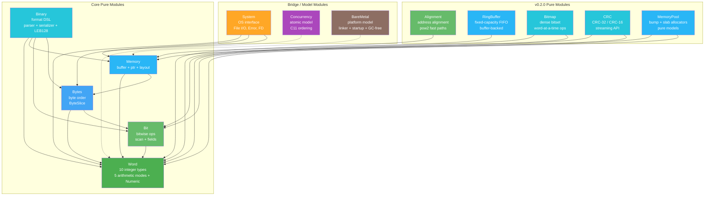

# Component Architecture

> **Audience**: Developers, Contributors

## Component Overview

Radix consists of 13 modules, each providing a distinct set of systems programming primitives. All modules follow the three-layer architecture (Spec → Impl → Bridge), and v0.2.0 adds six new building blocks on top of the original foundation: numeric typeclasses inside Word, alignment helpers, ring buffers, bitmaps, CRC implementations, and allocator models.

## Module Details

### Word — Fixed-Width Integer Types and Arithmetic

| Submodule | Layer | Description |
|-----------|-------|-------------|
| `Word.Spec` | 3 | Mathematical specifications using `BitVec n` |
| `Word.UInt` | 2 | `UInt8`, `UInt16`, `UInt32`, `UInt64` wrapping Lean 4 built-ins |
| `Word.Int` | 2 | `Int8`, `Int16`, `Int32`, `Int64` via two's complement |
| `Word.Size` | 2 | `UWord`, `IWord` — platform-width types (32/64 parametric) |
| `Word.Arith` | 2 | Wrapping, Saturating, Checked, Overflowing arithmetic |
| `Word.Conv` | 2 | Width conversions, sign conversions, sign-extend |
| `Word.Lemmas.*` | 3 | Ring, Overflow, BitVec, Conv proofs |

**Key design**: Types wrap Lean 4 built-in `UIntN` for zero-cost abstraction (NFR-002). Layer 3 specs use `BitVec n`. Equivalence is proven in `Word.Lemmas.BitVec`.

### Bit — Bitwise Operations

| Submodule | Layer | Description |
|-----------|-------|-------------|
| `Bit.Spec` | 3 | Bitwise operation specifications |
| `Bit.Ops` | 2 | AND, OR, XOR, NOT, shifts, rotates |
| `Bit.Scan` | 2 | `clz`, `ctz`, `popcount`, `bitReverse`, `hammingDistance` |
| `Bit.Field` | 2 | `testBit`, `setBit`, `clearBit`, `toggleBit`, `extractBits`, `insertBits` |
| `Bit.Lemmas` | 3 | Boolean algebra, De Morgan, shift identities, field round-trips |

**Key design**: All shift/rotate operations normalize count by `count % bitWidth` (Rust semantics, FR-002.1a).

### Bytes — Byte Order Operations

| Submodule | Layer | Description |
|-----------|-------|-------------|
| `Bytes.Spec` | 3 | Endianness and byte swap specifications |
| `Bytes.Order` | 2 | `bswap`, `toBigEndian`/`fromBigEndian`, `toLittleEndian`/`fromLittleEndian` |
| `Bytes.Slice` | 2 | `ByteSlice` — bounds-checked `ByteArray` view with endian-aware reads |
| `Bytes.Lemmas` | 3 | `bswap` involution, BE/LE round-trip, signed type round-trips |

### Memory — Abstract Memory Model

| Submodule | Layer | Description |
|-----------|-------|-------------|
| `Memory.Spec` | 3 | Region, alignment, disjointness definitions |
| `Memory.Model` | 2 | `Buffer` — `ByteArray`-based memory with proof-carrying read/write |
| `Memory.Ptr` | 2 | `Ptr n` — byte-width–parametric pointer abstraction |
| `Memory.Layout` | 2 | `FieldDesc`, `LayoutDesc` — packed struct layout computation |
| `Memory.Lemmas` | 3 | Buffer size preservation, region disjointness, alignment proofs |

### Binary — Binary Format DSL

| Submodule | Layer | Description |
|-----------|-------|-------------|
| `Binary.Spec` | 3 | `FormatSpec` and validity conditions |
| `Binary.Format` | 2 | `Format` inductive — DSL for describing binary layouts |
| `Binary.Parser` | 2 | Format-driven parser with endianness support |
| `Binary.Serial` | 2 | Format-driven serializer |
| `Binary.Leb128` | 2 | LEB128 variable-length integer encoding/decoding |
| `Binary.Leb128.Spec` | 3 | LEB128 mathematical specification |
| `Binary.Leb128.Lemmas` | 3 | Round-trip proofs, size bounds |
| `Binary.Lemmas` | 3 | Format proofs, parser/serializer properties |

### System — System Call Interface

| Submodule | Layer | Description |
|-----------|-------|-------------|
| `System.Spec` | 3 | `FileState` state machine, pre/postconditions, `ReadSpec`/`WriteSpec` |
| `System.Error` | 2 | `SysError` inductive (10 variants), `fromIOError` mapping |
| `System.FD` | 2 | `FD` (file descriptor), `Ownership`, `OpenMode`, `withFile` bracket |
| `System.IO` | 1 | `sysRead`, `sysWrite`, `sysSeek`, file convenience functions |
| `System.Assumptions` | 1 | `trust_*` axioms citing POSIX.1-2024 |

### Concurrency — Atomic Operations Model

| Submodule | Layer | Description |
|-----------|-------|-------------|
| `Concurrency.Spec` | 3 | `MemoryOrder`, `MemoryEvent`, `happensBefore`, `isDataRace`, `isLinearizable` |
| `Concurrency.Ordering` | 2 | Ordering strength comparison, strengthen, combine |
| `Concurrency.Atomic` | 2 | `AtomicCell`, atomic load/store/CAS, fetch operations |
| `Concurrency.Lemmas` | 3 | Ordering strength proofs, DRF proofs, linearizability |
| `Concurrency.Assumptions` | 1 | `trust_atomic_word_access`, `trust_cas_atomicity`, etc. |

### BareMetal — Bare Metal Support

| Submodule | Layer | Description |
|-----------|-------|-------------|
| `BareMetal.Spec` | 3 | `Platform`, `RegionKind`, `MemoryMap`, `StartupPhase`, `BootInvariant` |
| `BareMetal.GCFree` | 2 | `Lifetime`, `ForbiddenPattern`, `GCFreeConstraint`, stack analysis |
| `BareMetal.Linker` | 2 | `LinkerScript`, `Section`, `Symbol`, address alignment |
| `BareMetal.Startup` | 2 | `StartupAction`, minimal/full startup actions, validation |
| `BareMetal.Lemmas` | 3 | Region disjointness, memory map, alignment, startup proofs |
| `BareMetal.Assumptions` | 1 | `trust_reset_entry`, `trust_bss_zeroed`, etc. |

### Alignment — Alignment Utilities

| Submodule | Layer | Description |
|-----------|-------|-------------|
| `Alignment.Spec` | 3 | Mathematical alignment specification and power-of-two rules |
| `Alignment.Ops` | 2 | `alignUp`, `alignDown`, `isAligned`, `alignPadding`, fast paths |
| `Alignment.Lemmas` | 3 | Sandwich bounds, round-trip, and ops-vs-spec equivalence proofs |

### RingBuffer — Fixed-Capacity Circular Queue

| Submodule | Layer | Description |
|-----------|-------|-------------|
| `RingBuffer.Spec` | 3 | FIFO queue state model and invariants |
| `RingBuffer.Impl` | 2 | `push`, `pop`, `peek`, `pushForce`, batch operations |
| `RingBuffer.Lemmas` | 3 | Capacity conservation, FIFO ordering, invariant preservation |

### Bitmap — Dense Bit Array

| Submodule | Layer | Description |
|-----------|-------|-------------|
| `Bitmap.Spec` | 3 | Abstract bitset model and last-word-clean invariant |
| `Bitmap.Ops` | 2 | Bit updates, set algebra, population count, search operations |
| `Bitmap.Lemmas` | 3 | Boolean algebra properties and invariant preservation proofs |

### CRC — Checksum Algorithms

| Submodule | Layer | Description |
|-----------|-------|-------------|
| `CRC.Spec` | 3 | GF(2) polynomial model for CRC-32 and CRC-16 |
| `CRC.Ops` | 2 | Table-driven CRC implementations and streaming API |
| `CRC.Lemmas` | 3 | Streaming consistency and algebraic correctness proofs |

### MemoryPool — Allocator Models

| Submodule | Layer | Description |
|-----------|-------|-------------|
| `MemoryPool.Spec` | 3 | Bump/slab allocator state models and safety invariants |
| `MemoryPool.Model` | 2 | Pure allocator models backed by `Memory.Buffer` |
| `MemoryPool.Lemmas` | 3 | Capacity tracking, reset correctness, no double-free proofs |

## Related Documents

- [Architecture Overview](README.md) — High-level architecture
- [Module Dependencies](module-dependency.md) — Dependency graph
- [Data Model](data-model.md) — Core data structures
- [API Reference](../reference/api/) — Detailed API per module
