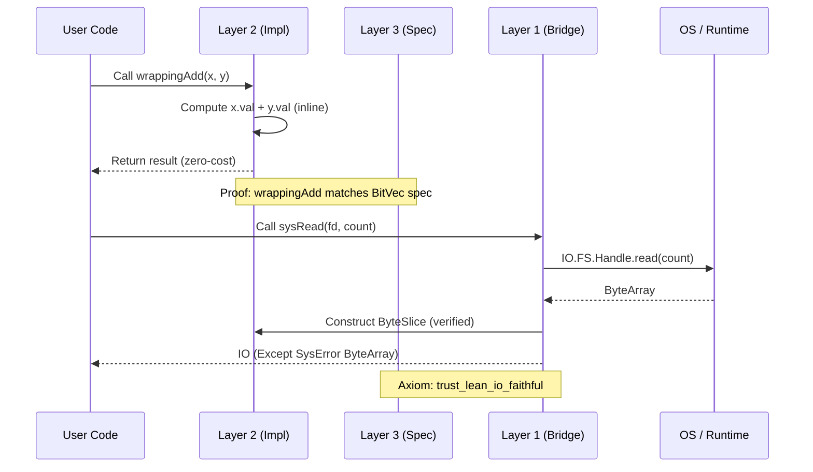
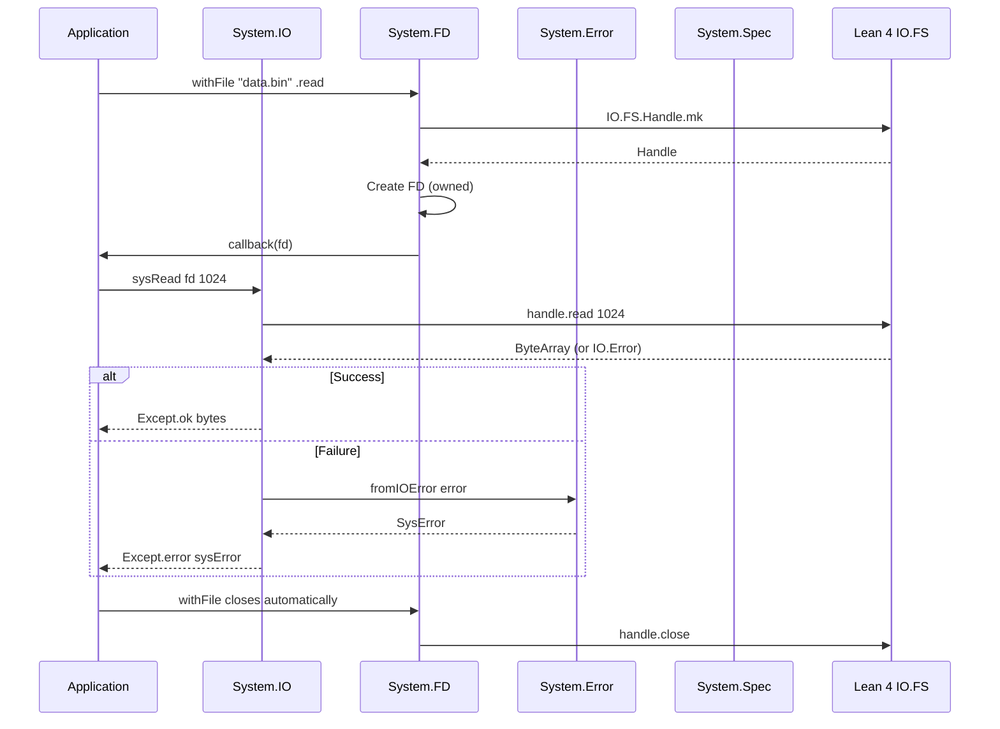
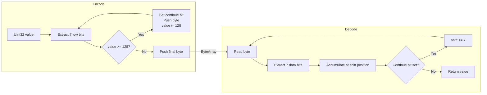
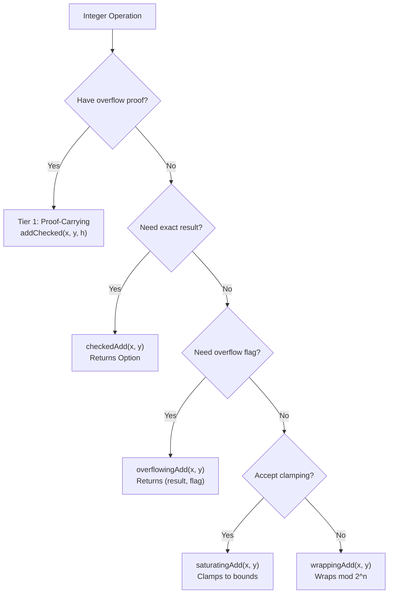

# Data Flow

> **Audience**: Developers, Contributors

## Layer 3 → Layer 2 → Layer 1 Flow

Data in Radix flows through the three-layer architecture. Specifications (Layer 3) define correctness, implementations (Layer 2) perform computation, and the bridge (Layer 1) connects to the OS.



## File Read Flow (End-to-End)



## Binary Parse/Serialize Round-Trip

```mermaid
sequenceDiagram
    participant App as Application
    participant Fmt as Binary.Format
    participant Ser as Binary.Serial
    participant Par as Binary.Parser
    participant Buf as Memory.Buffer

    App->>Fmt: Define format (u16be, u32le, pad 2)
    App->>Ser: serializeFormat format values
    Ser->>Buf: Write fields with endianness
    Buf-->>Ser: ByteArray
    Ser-->>App: ByteArray (serialized)

    App->>Par: parseFormat format data
    Par->>Buf: Read fields with endianness
    Buf-->>Par: FieldValues
    Par-->>App: List FieldValue (parsed)

    Note over Ser,Par: Proof: parse ∘ serialize = id
```

## LEB128 Encode/Decode Flow



## Arithmetic Mode Selection



## Related Documents

- [Architecture Overview](README.md) — Three-layer model
- [Components](components.md) — Module details
- [Module Dependencies](module-dependency.md) — Dependency graph
