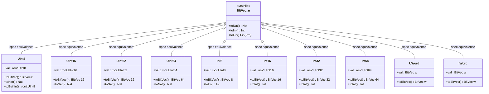
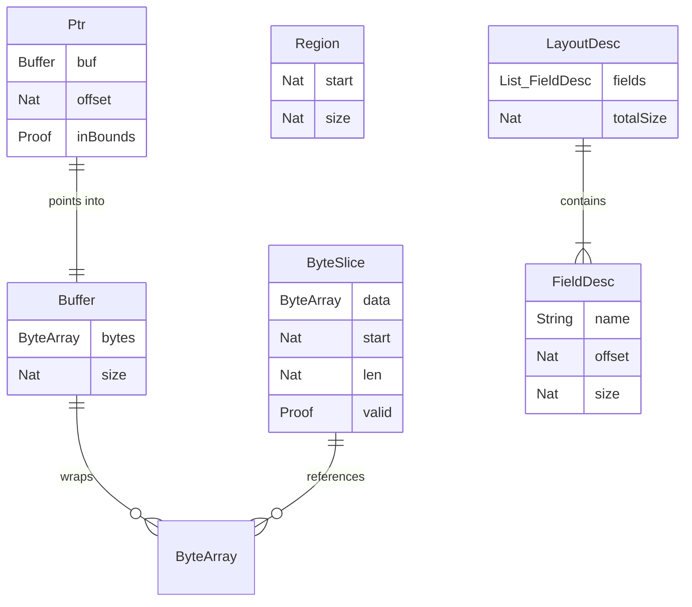
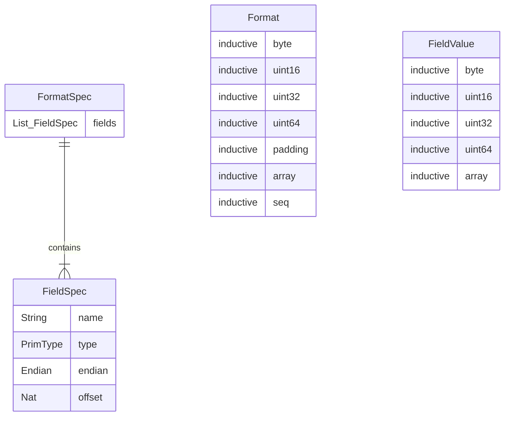
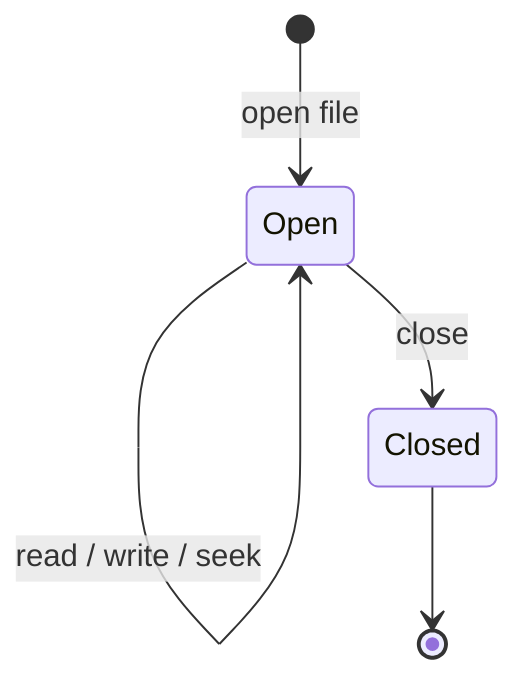
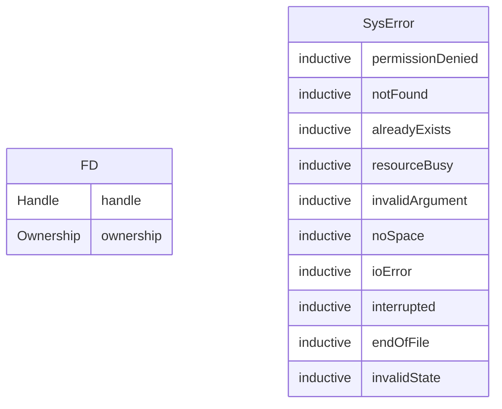
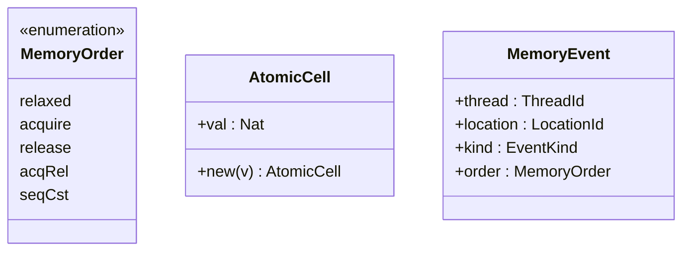
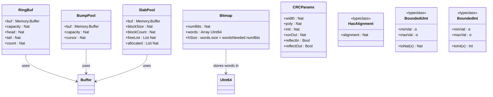

# Data Model

> **Audience**: Developers, Contributors

## Core Type Hierarchy

## Memory Data Structures

## Binary Format Types

## System Types

## Concurrency Types

## v0.2.0 Data Structures

These structures are the main v0.2.0 additions: queue state in `RingBuf`, dense bit storage in `Bitmap`, arena and slab allocation state in `BumpPool` and `SlabPool`, CRC parameterization in `CRCParams`, and width-generic abstractions via `HasAlignment`, `BoundedUInt`, and `BoundedInt`.

## Relationship: Radix Types ↔ BitVec

Every Radix integer type has a proven equivalence with `BitVec n`:

| Radix Type | Internal Storage | BitVec Width | Conversion |
|------------|-----------------|--------------|------------|
| `UInt8` | `_root_.UInt8` | `BitVec 8` | `toBitVec` / `fromBitVec` |
| `UInt16` | `_root_.UInt16` | `BitVec 16` | `toBitVec` / `fromBitVec` |
| `UInt32` | `_root_.UInt32` | `BitVec 32` | `toBitVec` / `fromBitVec` |
| `UInt64` | `_root_.UInt64` | `BitVec 64` | `toBitVec` / `fromBitVec` |
| `Int8` | `_root_.UInt8` | `BitVec 8` | `toBitVec` / `fromBitVec` |
| `Int16` | `_root_.UInt16` | `BitVec 16` | `toBitVec` / `fromBitVec` |
| `Int32` | `_root_.UInt32` | `BitVec 32` | `toBitVec` / `fromBitVec` |
| `Int64` | `_root_.UInt64` | `BitVec 64` | `toBitVec` / `fromBitVec` |
| `UWord` | `BitVec w` | `BitVec w` | `toBitVec` / `fromBitVec` |
| `IWord` | `BitVec w` | `BitVec w` | `toBitVec` / `fromBitVec` |

## Related Documents

- [Architecture Overview](README.md) — Three-layer architecture
- [Components](components.md) — Module breakdown
- [API Reference](../reference/api/) — Full API documentation
