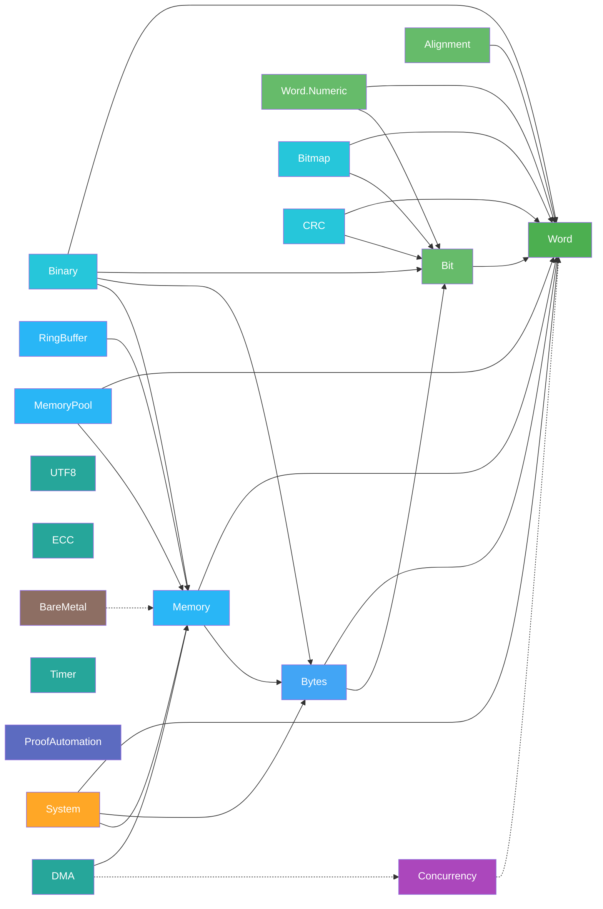

# Module Dependency Graph

> **Audience**: Developers, Contributors

## High-Level Dependencies

## Detailed Submodule Dependencies

```mermaid
graph TD
    subgraph "Word Module"
        WSpec["Word.Spec<br/>(Layer 3)"]
        WUInt["Word.UInt<br/>(Layer 2)"] --> WSpec
        WInt["Word.Int<br/>(Layer 2)"] --> WUInt
        WSize["Word.Size<br/>(Layer 2)"] --> WSpec
        WArith["Word.Arith<br/>(Layer 2)"] --> WUInt
        WArith --> WInt
        WArith --> WSize
        WConv["Word.Conv<br/>(Layer 2)"] --> WUInt
        WConv --> WInt
        WConv --> WSize
        WNum["Word.Numeric<br/>(Layer 2)"] --> WUInt
        WNum --> WInt
        WNum --> WSize
        WNum --> BOps
        WNum --> BScan
        WNum --> BField
        WLemmas["Word.Lemmas.*<br/>(Layer 3)"] --> WArith
        WLemmas --> WConv
        WLemmas --> WNum
    end
    subgraph "Bit Module"
        BSpec["Bit.Spec<br/>(Layer 3)"]
        BOps["Bit.Ops<br/>(Layer 2)"] --> WUInt
        BOps --> WInt
        BOps --> WSize
        BScan["Bit.Scan<br/>(Layer 2)"] --> BOps
        BField["Bit.Field<br/>(Layer 2)"] --> BOps
        BLemmas["Bit.Lemmas<br/>(Layer 3)"] --> BScan
        BLemmas --> BField
    end
    subgraph "Bytes Module"
        BySpec["Bytes.Spec<br/>(Layer 3)"]
        ByOrd["Bytes.Order<br/>(Layer 2)"] --> WUInt
        ByOrd --> WInt
        BySlice["Bytes.Slice<br/>(Layer 2)"] --> ByOrd
        ByLemmas["Bytes.Lemmas<br/>(Layer 3)"] --> BySlice
    end
    subgraph "Memory Module"
        MSpec["Memory.Spec<br/>(Layer 3)"]
        MModel["Memory.Model<br/>(Layer 2)"] --> ByOrd
        MPtr["Memory.Ptr<br/>(Layer 2)"] --> MModel
        MLay["Memory.Layout<br/>(Layer 2)"]
        MLemmas["Memory.Lemmas<br/>(Layer 3)"] --> MModel
        MLemmas --> MPtr
        MLemmas --> MLay
    end
    subgraph "Binary Module"
        BnSpec["Binary.Spec<br/>(Layer 3)"]
        BnFmt["Binary.Format<br/>(Layer 2)"] --> BnSpec
        BnParser["Binary.Parser<br/>(Layer 2)"] --> BnFmt
        BnParser --> BySlice
        BnSerial["Binary.Serial<br/>(Layer 2)"] --> BnFmt
        BnLeb["Binary.Leb128<br/>(Layer 2)"] --> WUInt
        BnLeb --> WInt
        BnLemmas["Binary.Lemmas<br/>(Layer 3)"] --> BnParser
        BnLemmas --> BnSerial
    end
    subgraph "System Module"
        SSpec["System.Spec<br/>(Layer 3)"]
        SErr["System.Error<br/>(Layer 2)"]
        SFD["System.FD<br/>(Layer 2)"] --> SErr
        SIO["System.IO<br/>(Layer 1)"] --> SFD
        SIO --> SSpec
        SAssume["System.Assumptions<br/>(Layer 1)"] --> SSpec
    end

    subgraph "Concurrency Module"
        CSpec["Concurrency.Spec<br/>(Layer 3)"]
        COrd["Concurrency.Ordering<br/>(Layer 2)"] --> CSpec
        CAtomic["Concurrency.Atomic<br/>(Layer 2)"] --> CSpec
        CLemmas["Concurrency.Lemmas<br/>(Layer 3)"] --> COrd
        CLemmas --> CAtomic
    end

    subgraph "v0.2.0 Modules"
        ASpec["Alignment.Spec<br/>(Layer 3)"]
        AOps["Alignment.Ops<br/>(Layer 2)"] --> ASpec
        AOps --> WUInt
        ALemmas["Alignment.Lemmas<br/>(Layer 3)"] --> AOps

        RBSpec["RingBuffer.Spec<br/>(Layer 3)"]
        RBImpl["RingBuffer.Impl<br/>(Layer 2)"] --> RBSpec
        RBImpl --> MModel
        RBLemmas["RingBuffer.Lemmas<br/>(Layer 3)"] --> RBImpl

        BmSpec["Bitmap.Spec<br/>(Layer 3)"]
        BmOps["Bitmap.Ops<br/>(Layer 2)"] --> BmSpec
        BmOps --> WUInt
        BmOps --> BOps
        BmOps --> BScan
        BmLemmas["Bitmap.Lemmas<br/>(Layer 3)"] --> BmOps

        CRCSpec["CRC.Spec<br/>(Layer 3)"]
        CRCOps["CRC.Ops<br/>(Layer 2)"] --> CRCSpec
        CRCOps --> WUInt
        CRCOps --> WArith
        CRCOps --> BOps
        CRCLemmas["CRC.Lemmas<br/>(Layer 3)"] --> CRCOps

        MPSpec["MemoryPool.Spec<br/>(Layer 3)"]
        MPModel["MemoryPool.Model<br/>(Layer 2)"] --> MPSpec
        MPModel --> MModel
        MPModel --> WUInt
        MPLemmas["MemoryPool.Lemmas<br/>(Layer 3)"] --> MPModel
    end

    subgraph "v0.3.0 Modules"
        USpec["UTF8.Spec<br/>(Layer 3)"]
        UOps["UTF8.Ops<br/>(Layer 2)"] --> USpec
        ULemmas["UTF8.Lemmas<br/>(Layer 3)"] --> UOps

        ESpec["ECC.Spec<br/>(Layer 3)"]
        EOps["ECC.Ops<br/>(Layer 2)"] --> ESpec
        ELemmas["ECC.Lemmas<br/>(Layer 3)"] --> EOps

        DSpec["DMA.Spec<br/>(Layer 3)"] --> MSpec
        DSpec -.-> CSpec
        DOps["DMA.Ops<br/>(Layer 2)"] --> DSpec
        DLemmas["DMA.Lemmas<br/>(Layer 3)"] --> DOps

        TSpec["Timer.Spec<br/>(Layer 3)"]
        TOps["Timer.Ops<br/>(Layer 2)"] --> TSpec
        TLemmas["Timer.Lemmas<br/>(Layer 3)"] --> TOps
    end

    subgraph "Meta Proof Support"
        PAuto["ProofAutomation<br/>(Meta-level macros)"]
    end
```

## External Dependencies

| Dependency | Source | Purpose |
|------------|--------|---------|
| **Mathlib** | `leanprover-community/mathlib4` | `BitVec n`, algebraic structures, proof tactics |
| **Batteries** | `leanprover-community/batteries` | Standard library extensions (transitive via Mathlib) |
| **Plausible** | `leanprover-community/plausible` | Property-based testing (transitive via Mathlib) |

## Dependency Principles

- **Word** has zero internal dependencies — it is the foundation
- **Word.Numeric** extends Word with width-generic APIs and reuses Bit operations
- **Bit** depends only on Word types (not on Word.Arith)
- **Bytes** depends on Word and Bit
- **Memory** depends on Word and Bytes (not on Bit directly)
- **Memory** now includes region algebra primitives in `Memory.Spec.Region`
- **Binary** depends on Word, Bit, Bytes, and Memory
- **Alignment** depends on Word only
- **RingBuffer** depends on Memory
- **Bitmap** depends on Word and Bit
- **CRC** depends on Word, Word.Arith, and Bit
- **MemoryPool** depends on Memory and Word
- **UTF8** is self-contained over raw bytes and `ByteArray`
- **ECC** is a self-contained coding-theory primitive
- **DMA** depends on Memory plus the Concurrency ordering model
- **Timer** is a self-contained logical-clock model
- **System** depends on Word, Bytes, and Memory
- **Concurrency** and **BareMetal** are standalone model modules
- **ProofAutomation** is a meta-level helper over Mathlib tactics

## Related Documents

- [Architecture Overview](README.md) — High-level architecture
- [Components](components.md) — Component breakdown
- [Data Flow](data-flow.md) — Data flow between layers
