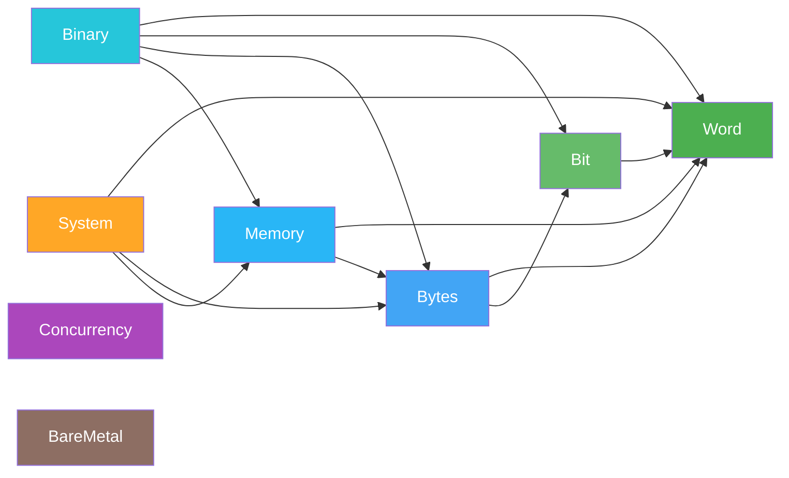
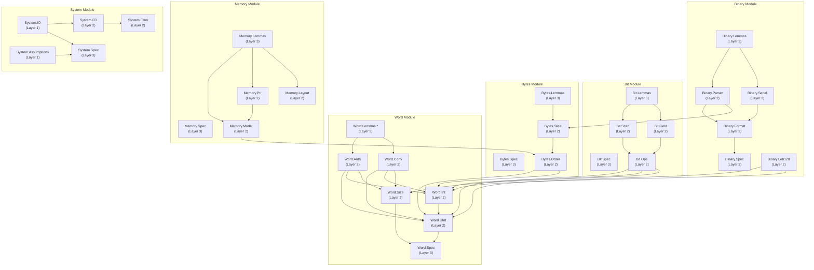

# Module Dependency Graph

> **Audience**: Developers, Contributors

## High-Level Dependencies

## Detailed Submodule Dependencies

## External Dependencies

| Dependency | Source | Purpose |
|------------|--------|---------|
| **Mathlib** | `leanprover-community/mathlib4` | `BitVec n`, algebraic structures, proof tactics |
| **Batteries** | `leanprover-community/batteries` | Standard library extensions (transitive via Mathlib) |
| **Plausible** | `leanprover-community/plausible` | Property-based testing (transitive via Mathlib) |

## Dependency Principles

- **Word** has zero internal dependencies — it is the foundation
- **Bit** depends only on Word types (not on Word.Arith)
- **Bytes** depends on Word and Bit
- **Memory** depends on Word and Bytes (not on Bit directly)
- **Binary** depends on Word, Bit, Bytes, and Memory
- **System** depends on Word, Bytes, and Memory
- **Concurrency** and **BareMetal** are standalone model modules

## Related Documents

- [Architecture Overview](README.md) — High-level architecture
- [Components](components.md) — Component breakdown
- [Data Flow](data-flow.md) — Data flow between layers
