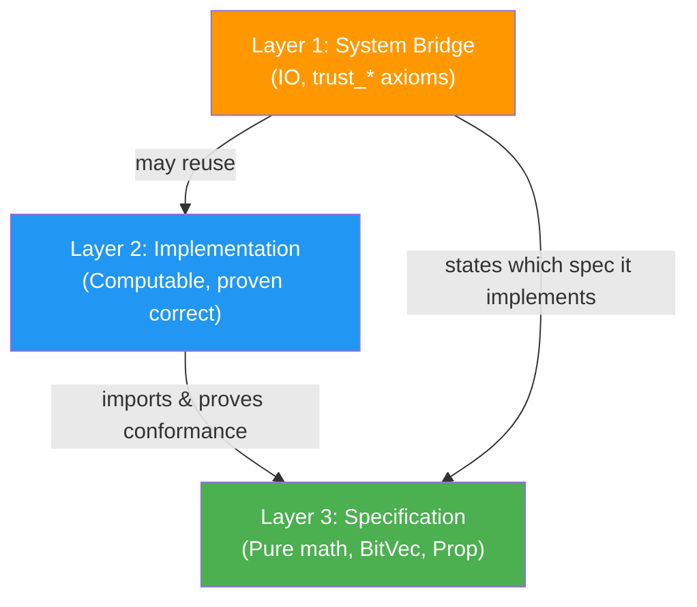
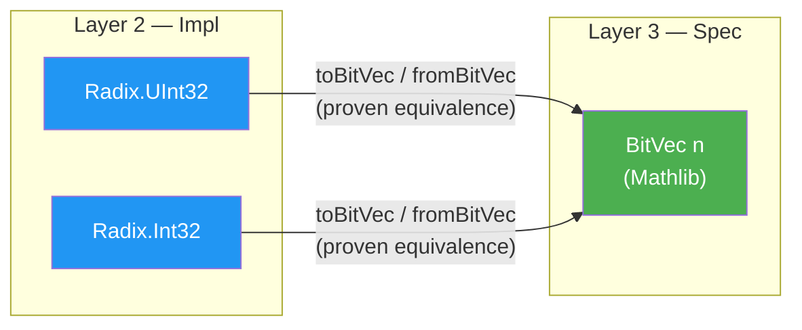

# Architecture Decision Records

> **Audience**: All

## Overview

Architecture Decision Records (ADRs) capture significant architectural decisions made during Radix development. Each ADR documents the context, the decision itself, alternatives considered, and the consequences.

The canonical ADR source files are maintained under [`spec/adr/`](../../../spec/adr/).

## ADR Index

| ADR | Title | Status | Summary |
|-----|-------|--------|---------|
| [ADR-001](#adr-001-three-layer-architecture) | Three-Layer Architecture | Proposed | Maximize verified code, minimize the TCB |
| [ADR-002](#adr-002-build-on-mathlib-bitvec) | Build on Mathlib BitVec | Proposed | Use `BitVec n` as specification-level canonical representation |
| [ADR-003](#adr-003-signed-integers-via-twos-complement-wrapper) | Signed Integers via Two's Complement Wrapper | Proposed | Signed types wrap unsigned storage for zero-cost abstraction |
| [ADR-004](#adr-004-trunk-based-development-with-release-branches) | Trunk-Based Development with Release Branches | Proposed | Branching strategy optimized for solo-maintained verified library |

---

## ADR-001: Three-Layer Architecture

**Status:** Proposed

**Context:** Radix provides formally verified low-level primitives while also interfacing with real operating systems. Formal verification cannot extend to FFI calls—there is always a boundary between verified and trusted code. The architecture must maximize the verified portion and minimize the trusted portion.

**Decision:** Adopt a three-layer architecture:

- **Layer 3 (Verified Specification)** — Pure mathematical specifications and theorems. No executable code.
- **Layer 2 (Verified Implementation)** — Pure Lean 4 implementations with proofs that they satisfy Layer 3 specifications.
- **Layer 1 (System Bridge)** — Lean 4 code wrapping built-in IO APIs. Contains named trusted assumptions (`axiom` declarations) asserting that IO behavior matches `System.Spec`.



**Import rules:**
| Layer | May Import |
|-------|-----------|
| Layer 3 (Spec) | Nothing (self-contained) |
| Layer 2 (Impl) | Layer 3 only |
| Layer 1 (Bridge) | Layer 3, optionally Layer 2 |

**Alternatives rejected:**
1. **Single-layer** — TCB boundary unclear; FFI changes break proofs.
2. **Two-layer** (spec+impl combined) — Implementation details leak into specification; harder to reason independently.
3. **F\*-style extraction** (verify in Lean 4, extract to C) — No Lean 4-to-C extraction pipeline exists; violates C-001.

**Rationale:** Proven successful in seL4 and CertiKOS. Provides a clear TCB boundary and enables independent verification.

**Consequences:** More files to manage, but a clear audit trail for TCB (inspect `@[extern]` + `trust_*` axioms).

> **Source:** [`spec/adr/0001-three-layer-architecture.md`](../../../spec/adr/0001-three-layer-architecture.md)

---

## ADR-002: Build on Mathlib BitVec

**Status:** Proposed

**Context:** Lean 4 Mathlib provides `BitVec n`, a fixed-width bitvector type with growing arithmetic/bitwise support. Radix needs fixed-width integer types as its foundation.

**Decision:** Use Mathlib's `BitVec n` as the **specification-level** canonical representation (Layer 3). Radix types in Layer 2 are defined as wrappers proven equivalent to `BitVec` operations.



**Alternatives rejected:**
1. **Use `BitVec` directly everywhere** — No control over API; Mathlib upgrades may break everything.
2. **Completely independent implementation** — Massive proof duplication; lose community investment.

**Rationale:** Mathlib's `BitVec` is actively maintained with growing proof coverage. However, its API is designed for mathematical reasoning, not systems programming. Radix wrapper types provide a systems-friendly API while leveraging Mathlib proofs.

**Consequences:**
- Mathlib is a required dependency
- Radix types carry a proof of `BitVec` equivalence
- Users can drop down to `BitVec` when they need Mathlib lemmas directly

> **Source:** [`spec/adr/0002-build-on-mathlib-bitvec.md`](../../../spec/adr/0002-build-on-mathlib-bitvec.md)

---

## ADR-003: Signed Integers via Two's Complement Wrapper

**Status:** Proposed

**Context:** Lean 4 has no built-in signed fixed-width integer types. Its `Int` is arbitrary-precision. Systems programming requires `Int8`–`Int64` with two's complement semantics matching C's `int8_t`–`int64_t`.

**Decision:** Define signed integer types as structs wrapping Lean 4's built-in unsigned integer types:

```lean
structure Int8 where
  val : UInt8

structure Int32 where
  val : _root_.UInt32
```

The sign is determined by the MSB. Operations map directly to Lean 4's built-in `UIntX` operations (which compile to single C instructions), with correctness proven against a `BitVec` interpretation model.

**Alternatives rejected:**
1. **Wrapper around `Int` with bounds proof** — e.g., `(val : Int) (h : -128 ≤ val ∧ val ≤ 127)`. Every operation needs bounds proofs; not bit-compatible; completely fails NFR-002 (zero-cost abstractions).
2. **Wrapper around `BitVec`** — Lean 4's compiler does not currently map `BitVec` directly to C primitives. Every arithmetic operation would allocate objects, destroying performance.

**Rationale:** Zero-cost abstraction (NFR-002) is a hard constraint. Wrapping Lean 4's built-in `UIntX` types is the only way to guarantee that basic arithmetic compiles to raw CPU instructions. Using `BitVec` as the common foundation for both signed and unsigned types at the proof layer means shared proofs for bitwise operations.

**Consequences:**
- `Int8.bits` and `UInt8.bits` are the same type (`BitVec 8`)
- Casting between signed/unsigned is free (same bits, different interpretation)
- Sign-dependent operations (comparison, division, arithmetic right shift) need separate implementations with separate proofs

> **Source:** [`spec/adr/0003-signed-integers-twos-complement.md`](../../../spec/adr/0003-signed-integers-twos-complement.md)

---

## ADR-004: Trunk-Based Development with Release Branches

**Status:** Proposed

**Context:** Radix is a formally verified Lean 4 library maintained by a solo lead maintainer with open-source contributors via fork-and-PR. The project uses SemVer, depends on Lean 4 and Mathlib (both rapidly evolving), and needs to support patch releases on older versions while developing new features (e.g., maintaining v0.1.x while building v0.2.0). The CI pipeline was scaffolded with Git Flow-like branches (`develop`, `release/*`, `hotfix/*`) but the team has been working directly on `main`, creating an inconsistency.

**Decision:** Adopt **Trunk-Based Development with Release Branches**. The strategy has four branch types:

### Branch Types

| Branch | Lifetime | Purpose | Created From | Merges To |
|--------|----------|---------|-------------|-----------|
| `main` | Permanent | Trunk — all active development | — | — |
| `feat/*`, `fix/*`, `proof/*`, etc. | Short-lived (< 2 weeks) | Feature/fix work | `main` | `main` via PR |
| `release/vX.Y` | Medium-lived (until EOL) | Stabilization + patch releases | `main` (at feature-freeze) | Never back to `main` |
| `toolchain/lean-X.Y.Z` | Short-lived (< 2 weeks) | Lean 4 / Mathlib toolchain bumps | `main` | `main` via PR |

### Rules

1. **`main` is always buildable.** Every commit on `main` must pass CI with zero `sorry`. Direct pushes to `main` are prohibited; all changes flow through PRs.

2. **Feature branches are short-lived.** Branch from `main`, open a PR back to `main`. Target < 2 weeks lifetime. Use the existing naming convention: `feat/`, `fix/`, `proof/`, `docs/`, `refactor/`, `test/`, `ci/`.

3. **Release branches are cut just-in-time.** When preparing a release, cut `release/vX.Y` from `main`. Only bug fixes land on release branches — **never** new features. Release branches receive cherry-picks from `main`, never the reverse.

4. **Tags mark releases.** Tag `vX.Y.Z` on the release branch. The release pipeline triggers on `v*.*.*` tags (already configured).

5. **Toolchain branches isolate Lean 4 upgrades.** A Lean toolchain bump (e.g., `lean-toolchain` change from `leanprover/lean4:v4.29.0-rc4` to `v4.30.0`) can require proof updates across the entire codebase. These are done on `toolchain/lean-X.Y.Z`, verified by CI, and merged to `main` via PR.

6. **No `develop` branch.** With a solo maintainer, a permanent integration branch adds merge ceremony with no benefit. `main` serves as both development and integration branch.

7. **Fix on trunk, cherry-pick to release.** Production bug fixes are always implemented and verified on `main` first, then cherry-picked to the affected `release/vX.Y` branch. Exception: if a bug is release-branch-specific and cannot be reproduced on `main`.

8. **Release branches are deleted after EOL.** Once the next minor version is released and stable (e.g., v0.2.0 GA), the previous release branch (`release/v0.1`) may be deleted. A tag preserves the final state.

### Lifecycle Example

```
main ─────●────●────●────●────●────●────●────●────●────●────── →
          │    │         ↑    │         ↑              │
          │    │         │    │         │              │
          │    └─ feat/ring-buffer ─┘    │              │
          │                   │         │              │
          └─ release/v0.1 ───●──tag:v0.1.3            │
                              ↑                        │
                              cherry-pick              │
                                        │              │
                                        └─ toolchain/lean-4.30.0 ─┘
```

### Branch Protection Rules

| Branch | Required Reviews | CI Must Pass | Force Push | Delete |
|--------|-----------------|-------------|------------|--------|
| `main` | 0 (solo) / 1 (with contributors) | Yes | No | No |
| `release/v*` | 1 (for cherry-picks) | Yes | No | After EOL |
| `feat/*`, `fix/*`, etc. | 0 | Yes (on PR) | Yes (own branch) | After merge |

### CI Trigger Updates

The existing CI pipeline should watch:

```yaml
on:
  push:
    branches: [main, "release/*"]
  pull_request:
    branches: [main, "release/*"]
```

Remove `develop` and `hotfix/*` from CI triggers. Hotfixes follow the same flow as regular fixes (fix on `main`, cherry-pick to `release/*`), so `hotfix/*` is unnecessary as a separate category.

**Alternatives rejected:**

1. **Git Flow (`develop` + `release/*` + `hotfix/*`)** — The `develop` → `main` merge ceremony is overhead with no benefit for a solo maintainer. `hotfix/*` as a separate flow from `fix/*` adds process complexity without value when the fix-on-trunk-cherry-pick-to-release rule covers all cases.

2. **Pure Trunk-Based (release from tags on `main`, no release branches)** — Insufficient for a library with SemVer. Downstream users pin to `v0.1.x`. When `main` advances to v0.2.0 (potentially with a Lean toolchain bump), there is no branch to cherry-pick critical fixes for v0.1.x users.

3. **GitHub Flow (release from `main` only)** — Same problem as (2). Does not support concurrent maintenance of multiple minor versions.

4. **Long-lived feature branches (one per v0.2.0 feature)** — Merge conflicts compound. Formal proofs are particularly sensitive to rebasing — a theorem that builds on another theorem may need to be re-proven if the base changes. Short-lived branches minimize this.

**Rationale:**

- **Lean 4 specificity**: Toolchain bumps are a unique concern. A dedicated `toolchain/*` branch type makes these visible, isolates the blast radius, and ensures CI validates the entire proof base before merging. This is absent in standard branching models.
- **Formal verification constraint**: Proofs are fragile under rebase. Short-lived branches (< 2 weeks) minimize the probability of conflicting proof changes. The fix-on-trunk rule ensures all proofs are verified against the latest codebase first.
- **Solo maintainer optimization**: No `develop` branch, no separate `hotfix/*` flow. Minimal ceremony, maximum clarity.
- **Library consumer support**: Release branches enable patch support for older versions — critical for a foundation library that other projects depend on.
- **Industry alignment**: This model is used by Google (monorepo trunk + release branches), Lean 4 itself (master + release branches), and recommended by *Continuous Delivery* (Humble & Farley, 2010) and *Accelerate* (Forsgren et al., 2018) for high-performing teams.

**Consequences:**

- CI triggers need updating (remove `develop`, `hotfix/*`)
- CONTRIBUTING.md branch naming section needs the `toolchain/*` addition
- Cherry-pick discipline is required for release branch maintenance
- The `develop` branch (if it exists) should be deleted
- Contributors see a simple model: fork → branch from `main` → PR to `main`

> **Source:** [`spec/adr/0004-trunk-based-with-release-branches.md`](../../../spec/adr/0004-trunk-based-with-release-branches.md)

---

## Template

For new ADRs, use the template at [`spec/adr/template.md`](../../../spec/adr/template.md).

## Related Documents

- [Principles](principles.md) — Design philosophy
- [Patterns](patterns.md) — Recurring patterns derived from these decisions
- [Architecture Overview](../architecture/) — System design
