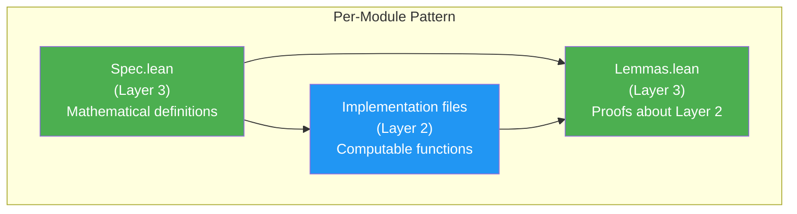

# Design Patterns

> **Audience**: Developers, Contributors

## Overview

Radix uses several recurring design patterns. Understanding these patterns makes it easier to read and contribute to the codebase.

## Three-Layer Pattern

Every module follows the same structural decomposition:



**Pattern:**
1. `Spec.lean` defines what correct behavior means (pure math, `BitVec`, predicates)
2. Implementation files provide computable functions wrapping Lean 4 primitives
3. `Lemmas.lean` proves that implementations satisfy the specifications

**Examples:**
- `Word.Spec` → `Word.UInt` + `Word.Arith` → `Word.Lemmas.Ring`
- `Bit.Spec` → `Bit.Ops` → `Bit.Lemmas`
- `Bytes.Spec` → `Bytes.Order` → `Bytes.Lemmas`

## Wrapper Pattern

Radix types wrap Lean 4 built-in types for zero-cost abstraction:

```lean
structure UInt32 where
  val : _root_.UInt32    -- Lean 4 built-in

@[inline] def UInt32.wrappingAdd (x y : UInt32) : UInt32 :=
  ⟨x.val + y.val⟩       -- Delegates to built-in arithmetic
```

**Motivation:** Lean 4's built-in `UInt32` compiles to C's `uint32_t`. Wrapping it instead of using `BitVec` directly ensures that operations compile to single CPU instructions (NFR-002).

**Applied to:** All 10 integer types (`UInt8`–`UInt64`, `Int8`–`Int64`, `UWord`, `IWord`).

## Two's Complement Pattern (ADR-003)

Signed types wrap unsigned storage:

```lean
structure Int32 where
  val : _root_.UInt32    -- Same storage as UInt32
```

The sign is determined by the MSB. Signed comparison uses bitwise operations:

```lean
@[inline] def Int32.slt (a b : Int32) : Bool :=
  -- XOR with sign bit to flip comparison for negative numbers
```

**Benefit:** No heap allocation. No `Int` boxing. Same memory layout as C.

## Spec Equivalence Pattern

Every Radix operation has a corresponding `BitVec` specification, and the equivalence is proven:

```
Radix.UInt32.wrappingAdd x y
  ↕ (toBitVec / fromBitVec, proven in Word.Lemmas.BitVec)
BitVec.add (x.toBitVec) (y.toBitVec)
  ↕ (defined in Word.Spec)
Radix.Word.Spec.wrappingAdd
```

**Proof shape:**
```lean
theorem wrappingAdd_toBitVec (x y : UInt32) :
    (wrappingAdd x y).toBitVec = x.toBitVec + y.toBitVec
```

## Tiered API Pattern

Modules providing bounded operations expose two tiers:

```lean
-- Tier 1: Proof-carrying (zero runtime cost)
def Buffer.readU8 (buf : Buffer) (offset : Nat)
    (h : offset < buf.size) : UInt8

-- Tier 2: Checked (returns Option)
def Buffer.checkedReadU8 (buf : Buffer) (offset : Nat) : Option UInt8 :=
  if h : offset < buf.size then some (buf.readU8 offset h) else none
```

**Pattern:** Tier 2 is implemented in terms of Tier 1 with a dynamic bounds check. This means Tier 1 proofs automatically apply to Tier 2.

**Applied to:** `Buffer` (read/write), `ByteSlice` (read/subslice), `Ptr` (dereferencing), `Word.Arith` (proof-carrying arithmetic).

## Arithmetic Mode Pattern

All 10 integer types support 5 arithmetic modes through a uniform API:

| Mode | Suffix | Return Type | Behavior on Overflow |
|------|--------|-------------|---------------------|
| Proof-carrying | `addChecked`* | `T` (with proof param) | Compile error if proof fails |
| Wrapping | `wrappingAdd` | `T` | Result mod 2^n |
| Saturating | `saturatingAdd` | `T` | Clamp to MIN/MAX |
| Checked | `checkedAdd` | `Option T` | `none` on overflow |
| Overflowing | `overflowingAdd` | `T × Bool` | Wrapping result + flag |

*Note: Tier 1 `addChecked` requires a proof of non-overflow as a parameter.

**Pattern:** Each mode is defined for each type × each operation (add, sub, mul, div, rem), with signed variants handling two's complement edge cases.

## Bracket Pattern (Resource Safety)

System resources use RAII-style bracket pattern:

```lean
def FD.withFile (path : String) (mode : OpenMode) (f : FD → IO α) : IO α
  -- Opens file → passes FD to callback → closes on exit (even on error)
```

**Guarantee:** The file descriptor is always closed, even if the callback throws an exception. This prevents resource leaks.

## Error Modeling Pattern

System operations return `IO (Except SysError α)` instead of throwing exceptions:

```lean
def sysRead (fd : FD) (count : Nat) : IO (Except SysError ByteArray)
```

**Rationale:** Explicit error handling via `Except` makes error paths visible in the type signature. No hidden exceptions. The `liftIO` combinator captures Lean 4's IO exceptions into `SysError`:

```lean
def liftIO (action : IO α) : IO (Except SysError α)
```

## Trusted Axiom Pattern

Layer 1 axioms follow a rigid format:

```lean
/-- Description citing external specification.
    Reference: POSIX.1-2024, Section X.Y.Z -/
axiom trust_<name> (params : Types) : Prop
```

**Rules:**
- `Prop`-typed (no computable content)
- `trust_` prefix for TCB auditability
- External specification citation in docstring
- Collected in `Assumptions.lean` files

## Involution Pattern

Several operations are their own inverse, and this is formally proven:

| Operation | Proof |
|-----------|-------|
| `bnot (bnot x) = x` | `Bit.Lemmas` |
| `bswap (bswap x) = x` | `Bytes.Lemmas` |
| `bitReverse (bitReverse x) = x` | `Bit.Lemmas` |
| `fromBitVec (toBitVec x) = x` | `Word.Lemmas.BitVec` |
| `fromBigEndian (toBigEndian x) = x` | `Bytes.Lemmas` |

These round-trip proofs are critical for correctness of encode/decode operations.

## Round-Trip Pattern

Encode/decode pairs are proven to be inverses:

| Pair | Proof Module |
|------|-------------|
| `encodeU32` / `decodeU32` | `Binary.Leb128.Lemmas` |
| `encodeU64` / `decodeU64` | `Binary.Leb128.Lemmas` |
| `encodeS32` / `decodeS32` | `Binary.Leb128.Lemmas` |
| `encodeS64` / `decodeS64` | `Binary.Leb128.Lemmas` |
| `toBigEndian` / `fromBigEndian` | `Bytes.Lemmas` |
| `toLittleEndian` / `fromLittleEndian` | `Bytes.Lemmas` |
| `serializeFormat` / `parseFormat` | Specified in `Binary.Spec` |
| `toBitVec` / `fromBitVec` | `Word.Lemmas.BitVec` |

## Related Documents

- [Principles](principles.md) — Design philosophy
- [Architecture](../architecture/) — System design
- [ADRs](adr.md) — Decision records
