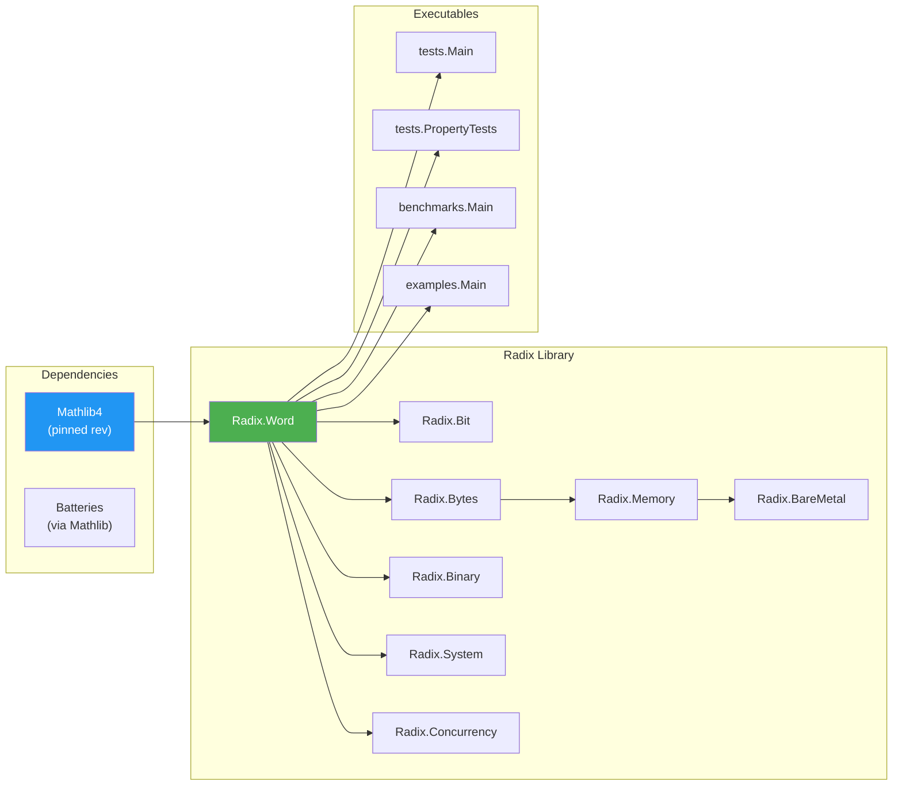

# Build System

> **Audience**: Contributors

## Overview

Radix uses **Lake**, Lean 4's built-in build system. The project configuration lives in `lakefile.lean`.

## Configuration

```lean
import Lake
open Lake DSL

package radix where
  leanOptions := #[
    ⟨`autoImplicit, false⟩
  ]

@[default_target]
lean_lib Radix where
  srcDir := "."

require mathlib from git
  "https://github.com/leanprover-community/mathlib4" @ "06e947358d88e36af006f915f79a04a10fd43cc4"

@[default_target]
lean_exe test where
  root := `tests.Main

lean_exe proptest where
  root := `tests.PropertyTests

lean_exe bench where
  root := `benchmarks.Main

lean_exe examples where
  root := `examples.Main
```

## Targets

| Target | Type | Root Module | Command |
|--------|------|-------------|---------|
| `Radix` | Library (default) | `Radix` | `lake build` |
| `test` | Executable (default) | `tests.Main` | `lake build test && lake exe test` |
| `proptest` | Executable | `tests.PropertyTests` | `lake build proptest && lake exe proptest` |
| `bench` | Executable | `benchmarks.Main` | `lake build bench && lake exe bench` |
| `examples` | Executable | `examples.Main` | `lake build examples && lake exe examples` |

> **Note:** `Radix` and `test` are both `@[default_target]`, so `lake build` builds both.

## Build Pipeline



## Common Commands

```bash
# Build library only
lake build Radix

# Build everything (library + test)
lake build

# Clean all build artifacts
lake clean

# Update dependencies (re-fetch Mathlib)
lake update

# Run specific executable
lake exe test
lake exe proptest
lake exe bench
lake exe examples
```

## Incremental Builds

Lake performs incremental compilation. After the first build, only changed files and their dependents are recompiled. Changing a `Spec.lean` file may trigger recompilation of the corresponding `Lemmas.lean` and all downstream modules.

## Mathlib Dependency

Mathlib is pinned by Git revision in `lakefile.lean`:

```lean
require mathlib from git
  "https://github.com/leanprover-community/mathlib4" @ "06e947358d88e36af006f915f79a04a10fd43cc4"
```

To update Mathlib:
1. Change the revision hash
2. Ensure `lean-toolchain` is compatible with the new Mathlib version
3. Run `lake update && lake build`
4. Fix any breaking changes

> **Warning:** Mathlib updates can introduce breaking changes. Always run the full test suite after updating.

## Benchmarks

The benchmark executable measures operation throughput in ns/op:

```bash
lake exe bench
```

### Anti-Optimization Measures (NFR-002.2)

Benchmarks implement three countermeasures against compiler optimization:

1. **Accumulator sink**: Each iteration feeds its result to the next, printed via `@[noinline]` function
2. **Input-dependent operands**: Pre-generated PRNG arrays indexed per iteration
3. **Validation step**: Final accumulator printed; 0 indicates invalid measurement

### C Baseline

A C equivalent is provided in `benchmarks/baseline.c`:

```bash
gcc -O2 -fno-builtin -o baseline benchmarks/baseline.c
./baseline
```

Results template: `benchmarks/results/template.md`

## Related Documents

- [Setup](setup.md) — Dev environment setup
- [Testing](testing.md) — Test strategy
- [Configuration Reference](../reference/configuration.md) — Full config options
