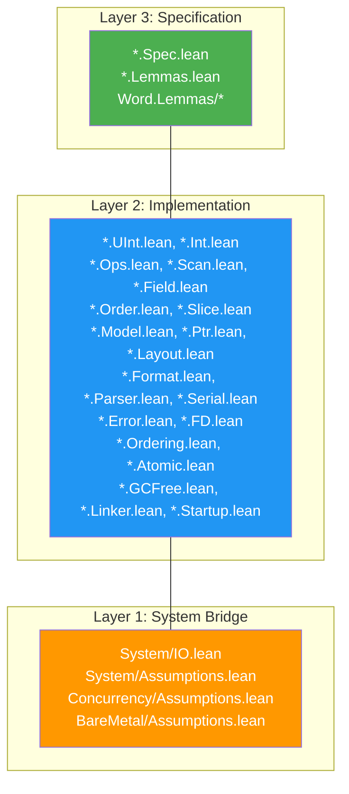

# Project Structure

> **Audience**: Contributors

## Directory Tree

```
radix/
├── lakefile.lean              # Lake build configuration
├── lean-toolchain             # Lean 4 version pin (v4.29.0-rc4)
├── Radix.lean                 # Root import (imports all 8 modules)
├── CHANGELOG.md               # Version history
├── TODO.md                    # Implementation tracking
├── test_helpers.lean          # Ad-hoc proof experiments
│
├── Radix/                     # Source modules (8 modules)
│   ├── Word.lean              # Word module aggregator
│   ├── Word/
│   │   ├── Spec.lean          # Layer 3: BitVec-based arithmetic specs
│   │   ├── UInt.lean          # Layer 2: UInt8/16/32/64 wrappers
│   │   ├── Int.lean           # Layer 2: Int8/16/32/64 (two's complement)
│   │   ├── Size.lean          # Layer 2: UWord/IWord (platform-width)
│   │   ├── Arith.lean         # Layer 2: 5 arithmetic modes × 10 types
│   │   ├── Conv.lean          # Layer 2: Width/sign conversions, signExtend
│   │   └── Lemmas/
│   │       ├── Ring.lean      # Layer 3: Ring proofs (comm, assoc, distrib)
│   │       ├── Overflow.lean  # Layer 3: Overflow detection proofs
│   │       ├── BitVec.lean    # Layer 3: BitVec equivalence round-trips
│   │       └── Conv.lean      # Layer 3: Conversion correctness proofs
│   │
│   ├── Bit.lean               # Bit module aggregator
│   ├── Bit/
│   │   ├── Spec.lean          # Layer 3: Bitwise operation specs
│   │   ├── Ops.lean           # Layer 2: AND/OR/XOR/NOT, shifts, rotates
│   │   ├── Scan.lean          # Layer 2: clz, ctz, popcount, bitReverse
│   │   ├── Field.lean         # Layer 2: testBit, setBit, extractBits, etc.
│   │   └── Lemmas.lean        # Layer 3: Boolean algebra, field round-trips
│   │
│   ├── Bytes.lean             # Bytes module aggregator
│   ├── Bytes/
│   │   ├── Spec.lean          # Layer 3: Endianness, bswap specs
│   │   ├── Order.lean         # Layer 2: bswap, BE/LE conversions
│   │   ├── Slice.lean         # Layer 2: ByteSlice (bounds-checked views)
│   │   └── Lemmas.lean        # Layer 3: Involution, round-trip proofs
│   │
│   ├── Memory.lean            # Memory module aggregator
│   ├── Memory/
│   │   ├── Spec.lean          # Layer 3: Region, alignment, buffer specs
│   │   ├── Model.lean         # Layer 2: Buffer (ByteArray-based)
│   │   ├── Ptr.lean           # Layer 2: Ptr n (byte-width pointer)
│   │   ├── Layout.lean        # Layer 2: FieldDesc, LayoutDesc
│   │   └── Lemmas.lean        # Layer 3: Size preservation, disjointness
│   │
│   ├── Binary.lean            # Binary module aggregator
│   ├── Binary/
│   │   ├── Spec.lean          # Layer 3: FormatSpec, validity conditions
│   │   ├── Format.lean        # Layer 2: Format inductive (DSL)
│   │   ├── Parser.lean        # Layer 2: Format-driven parser
│   │   ├── Serial.lean        # Layer 2: Format-driven serializer
│   │   ├── Leb128.lean        # Layer 2: LEB128 encode/decode
│   │   ├── Leb128/
│   │   │   ├── Spec.lean      # Layer 3: LEB128 mathematical spec
│   │   │   └── Lemmas.lean    # Layer 3: Round-trip, size bound proofs
│   │   └── Lemmas.lean        # Layer 3: Format proofs
│   │
│   ├── System.lean            # System module aggregator
│   ├── System/
│   │   ├── Spec.lean          # Layer 3: FileState machine, pre/postconditions
│   │   ├── Error.lean         # Layer 2: SysError type, fromIOError mapping
│   │   ├── FD.lean            # Layer 2: FD, Ownership, OpenMode, withFile
│   │   ├── IO.lean            # Layer 1: sysRead/Write/Seek, file ops
│   │   └── Assumptions.lean   # Layer 1: trust_* POSIX axioms
│   │
│   ├── Concurrency.lean       # Concurrency module aggregator
│   ├── Concurrency/
│   │   ├── Spec.lean          # Layer 3: MemoryOrder, events, data races
│   │   ├── Ordering.lean      # Layer 2: Ordering strength, combine
│   │   ├── Atomic.lean        # Layer 2: AtomicCell, load/store/CAS
│   │   ├── Lemmas.lean        # Layer 3: Linearizability, DRF proofs
│   │   └── Assumptions.lean   # Layer 1: trust_* hardware atomicity axioms
│   │
│   ├── BareMetal.lean         # BareMetal module aggregator
│   └── BareMetal/
│       ├── Spec.lean          # Layer 3: Platform, regions, boot invariants
│       ├── GCFree.lean        # Layer 2: Lifetime, forbidden patterns, constraints
│       ├── Linker.lean        # Layer 2: ELF sections, symbols, linker script
│       ├── Startup.lean       # Layer 2: Startup actions, validation
│       ├── Lemmas.lean        # Layer 3: Region, alignment, startup proofs
│       └── Assumptions.lean   # Layer 1: trust_* hardware axioms
│
├── tests/
│   ├── Main.lean              # Unit tests (all 8 modules)
│   └── PropertyTests.lean     # Property-based tests (500 iter, LCG PRNG)
│
├── benchmarks/
│   ├── Main.lean              # Microbenchmarks (10^6 iter, ns/op)
│   ├── baseline.c             # C baseline (gcc -O2 -fno-builtin)
│   └── results/
│       └── template.md        # Results reporting template
│
├── examples/
│   └── Main.lean              # 11-section executable usage examples
│
├── spec/                      # Formal specifications (design documents)
│   ├── README.md
│   ├── adr/                   # Architecture Decision Records
│   │   ├── README.md
│   │   ├── template.md
│   │   ├── 0001-three-layer-architecture.md
│   │   ├── 0002-build-on-mathlib-bitvec.md
│   │   └── 0003-signed-integers-twos-complement.md
│   ├── design/                # Design documents
│   │   ├── README.md
│   │   ├── architecture.md
│   │   ├── wasm-support-plan.md
│   │   └── components/        # Per-module behavior/interface specs
│   │       ├── binary/
│   │       ├── memory/
│   │       ├── system/
│   │       └── word/
│   ├── requirements/          # Requirements specifications
│   │   ├── README.md
│   │   ├── functional.md      # FR-001 through FR-008
│   │   ├── non-functional.md  # NFR-001 through NFR-008
│   │   ├── constraints.md     # C-001 through C-006
│   │   └── glossary.md
│   └── research/
│       └── verified-systems/  # Background research (F*, seL4, CertiKOS, Verus)
│
└── docs/                      # User-facing documentation
    ├── en/                    # English documentation
    │   ├── README.md          # Documentation hub
    │   ├── architecture/
    │   ├── getting-started/
    │   ├── reference/
    │   ├── guides/
    │   ├── development/
    │   └── design/
    └── ja/                    # Japanese documentation
```

## Module Layer Mapping



## Key Files

| File | Purpose |
|------|---------|
| `lakefile.lean` | Build configuration, dependencies, targets |
| `lean-toolchain` | Pinned Lean 4 version |
| `Radix.lean` | Root import — imports all 8 module aggregators |
| `TODO.md` | Implementation tracking with phase-based progress |
| `CHANGELOG.md` | Version history |

## Naming Conventions

| Pattern | Meaning |
|---------|---------|
| `*.Spec.lean` | Layer 3 specification (pure math, no computation) |
| `*.Lemmas.lean` | Layer 3 proofs about Layer 2 implementations |
| `*.Assumptions.lean` | Layer 1 trusted axioms (`trust_*` prefix) |
| `*.IO.lean` | Layer 1 system bridge (wraps Lean 4 IO APIs) |
| Other `*.lean` | Layer 2 implementation |

## File Size Overview

| Module | Impl Lines | Proof Lines | Total |
|--------|-----------|-------------|-------|
| Word | ~3,250 | ~4,600 | ~7,850 |
| Bit | ~1,400 | ~2,000 | ~3,400 |
| Wasm Extensions | ~220 | ~310 | ~530 |
| Bytes | ~950 | ~1,200 | ~2,150 |
| Memory | ~2,100 | ~2,500 | ~4,600 |
| Binary | ~2,200 | ~2,500 | ~4,700 |
| System | ~1,250 | ~400 | ~1,650 |
| Tests/Bench/Examples | ~3,500 | — | ~3,500 |
| **Total** | **~14,930** | **~13,510** | **~28,440** |

> **Note:** Proof-to-implementation ratio of ~0.9:1 is typical for verified systems. Comparable projects: HACL* ~110K lines, seL4 ~200K lines, Mathlib ~1.5M lines.

## Related Documents

- [Architecture Overview](../architecture/) — Three-layer design
- [Build](build.md) — Build system details
- [Module Dependencies](../architecture/module-dependency.md) — Dependency graph
