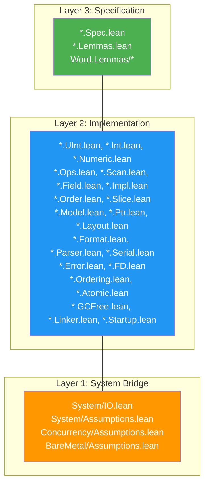

# Project Structure

> **Audience**: Contributors

## Directory Tree

```
radix/
├── lakefile.lean              # Lake build configuration
├── lean-toolchain             # Lean 4 version pin (v4.29.0-rc4)
├── Radix.lean                 # Root import (imports all 13 modules)
├── CHANGELOG.md               # Version history
├── test_helpers.lean          # Ad-hoc proof experiments
│
├── Radix/                     # Source modules (13 modules)
│   ├── Alignment.lean         # Alignment module aggregator
│   ├── Bitmap.lean            # Bitmap module aggregator
│   ├── CRC.lean               # CRC module aggregator
│   ├── MemoryPool.lean        # Memory pool module aggregator
│   ├── RingBuffer.lean        # Ring buffer module aggregator
│   ├── Word.lean              # Word module aggregator
│   ├── Bit.lean               # Bit module aggregator
│   ├── Bytes.lean             # Bytes module aggregator
│   ├── Memory.lean            # Memory module aggregator
│   ├── Binary.lean            # Binary module aggregator
│   ├── System.lean            # System module aggregator
│   ├── Concurrency.lean       # Concurrency module aggregator
│   ├── BareMetal.lean         # BareMetal module aggregator
│   └── <Module>/              # Per-module Spec / Impl / Lemmas / Assumptions files
│
├── tests/
│   ├── Main.lean              # Execution tests (all 13 modules)
│   ├── PropertyTests.lean     # Property-based tests (500 iter, LCG PRNG)
│   ├── ComprehensiveTests.lean # Full regression runner with assertion counts
│   └── ComprehensiveTests/    # Per-module comprehensive tests
│
├── benchmarks/
│   ├── Main.lean              # Microbenchmarks (10^6 iter, ns/op)
│   ├── baseline.c             # C baseline (gcc -O2 -fno-builtin)
│   └── results/
│       └── template.md        # Results reporting template
│
├── examples/
│   ├── Main.lean              # Orchestrates the examples executable
│   └── *.lean                 # 15 runnable example modules
│
└── docs/                      # User-facing documentation
    ├── en/                    # English documentation
    │   ├── README.md          # Documentation hub
    │   ├── architecture/
    │   ├── getting-started/
    │   ├── reference/
    │   ├── guides/
    │   ├── development/
    │   └── design/
    └── ja/                    # Japanese documentation
```

## Module Layer Mapping



## Key Files

| File | Purpose |
|------|---------|
| `lakefile.lean` | Build configuration, dependencies, targets |
| `lean-toolchain` | Pinned Lean 4 version |
| `Radix.lean` | Root import — imports all 13 module aggregators |
| `tests/ComprehensiveTests.lean` | Full regression entry point with assertion summaries |
| `CHANGELOG.md` | Version history |

## Naming Conventions

| Pattern | Meaning |
|---------|---------|
| `*.Spec.lean` | Layer 3 specification (pure math, no computation) |
| `*.Lemmas.lean` | Layer 3 proofs about Layer 2 implementations |
| `*.Assumptions.lean` | Layer 1 trusted axioms (`trust_*` prefix) |
| `*.IO.lean` | Layer 1 system bridge (wraps Lean 4 IO APIs) |
| Other `*.lean` | Layer 2 implementation |

## Repository Metrics

Exact line counts and proof totals change frequently across releases. Use the current CI artifacts, `lake build`, and the comprehensive test suite for authoritative release metrics.

## Related Documents

- [Architecture Overview](../architecture/) — Three-layer design
- [Build](build.md) — Build system details
- [Module Dependencies](../architecture/module-dependency.md) — Dependency graph
