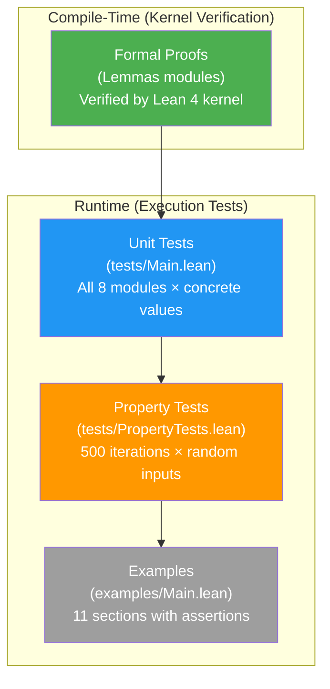

# Testing

> **Audience**: Contributors

## Test Strategy

Radix employs a multi-layered testing strategy:

| Layer | Type | What it verifies |
|-------|------|-----------------|
| **Formal proofs** | Lean 4 type system | Mathematical correctness (Lemmas modules) |
| **Unit tests** | `tests/Main.lean` | Concrete input/output correctness for all types |
| **Property tests** | `tests/PropertyTests.lean` | Algebraic properties hold over random inputs |
| **Examples** | `examples/Main.lean` | Usage examples execute with assertions |



## Running Tests

```bash
# Unit tests — all 8 modules
lake exe test

# Property-based tests — random + edge cases
lake exe proptest

# Examples — usage examples with assertions
lake exe examples

# All tests
lake exe test && lake exe proptest && lake exe examples
```

All commands should complete with zero failures.

## Unit Tests (`tests/Main.lean`)

Covers all 8 modules with concrete test values:

| Module | Coverage |
|--------|----------|
| **Word** | All 10 types (UInt8/16/32/64, Int8/16/32/64, UWord, IWord): wrapping, saturating, checked, overflowing arithmetic; signed comparison; edge cases (0, MAX, MIN, -1) |
| **Bit** | All 10 types: AND/OR/XOR/NOT, shifts, rotates, clz/ctz/popcount, bitReverse, extractBits/insertBits, hammingDistance, shrArith |
| **Bytes** | bswap, BE/LE conversions, ByteSlice read/write, signed type conversions |
| **Memory** | Buffer zeros/read/write, checked API, OOB handling, Ptr operations, Layout |
| **Binary** | Format DSL, Parser, Serial, round-trips, padding, multi-field formats |
| **System** | File write/read round-trip, metadata, exists check, string I/O, withFile bracket |
| **Concurrency** | Ordering classification, validity, CAS, strengthen/combine, AtomicCell ops, traces |
| **BareMetal** | Platform properties, regions, memory map, startup validation, GC-free, linker, alignment |

### Test Pattern

Each test function follows the pattern:

```lean
private def testUInt8 : IO Unit := do
  IO.println "  UInt8..."
  assert ((Radix.UInt8.wrappingAdd ⟨200⟩ ⟨100⟩).toNat == 44) "UInt8 wrappingAdd"
  -- ...more assertions
```

Failures produce descriptive error messages identifying the failing test.

## Property Tests (`tests/PropertyTests.lean`)

Randomized testing with 500 iterations per property using a deterministic LCG PRNG (Knuth MMIX: multiplier = 6364136223846793005, increment = 1442695040888963407).

### Properties Tested

**Arithmetic (all 10 types):**
- Commutativity: `wrappingAdd x y = wrappingAdd y x`
- Identity: `wrappingAdd x 0 = x`
- Inverse: `wrappingSub x x = 0`
- Self-subtraction: `wrappingSub x x = 0`
- Cross-validation: wrapping result == overflowing result (first component)

**Saturation:**
- `saturatingAdd x 0 = x`
- `saturatingSub x 0 = x`
- Bounds: `saturatingAdd x y ≥ max(x, y) ∨ saturatingAdd x y ≤ MAX`

**Bitwise (all 10 types):**
- De Morgan: `bnot(band x y) = bor(bnot x)(bnot y)`
- Involution: `bnot(bnot x) = x`
- Self-XOR: `bxor x x = 0`
- Self-AND: `band x x = x`
- Rotate/bitReverse involution
- popcount bounds

**Conversions:**
- Zero-extend/truncate round-trip
- Signed `toInt`/`fromInt` round-trip

**Byte Order:**
- `bswap(bswap x) = x` for UInt16/32/64
- BE/LE round-trips

**LEB128:**
- `decode(encode x) = some (x, size)` for U32/U64/S32/S64
- Size bounds: `encode(x).size ≤ maxSize`
- Edge cases: 0, 1, MAX, powers of 2

**Memory:**
- `Buffer.zeros n` has size `n`
- Checked read/write round-trip
- OOB returns `none`

**Binary Format:**
- Parse/serialize round-trip for various formats
- Multi-field round-trips

**System I/O:**
- File write/read round-trip
- File metadata correctness
- File existence check

### Edge Cases

Every property test includes exhaustive edge case testing:
- `0`, `1`, `MAX` for unsigned types
- `0`, `1`, `-1`, `MIN`, `MAX` for signed types
- Boundary arithmetic: `MAX + 1`, `MIN - 1`, `MIN / -1`

## Formal Proofs

Formal proofs are verified at compile time by Lean 4's kernel. They provide the strongest correctness guarantees:

| Proof Module | Properties |
|-------------|------------|
| `Word.Lemmas.Ring` | Ring structure for wrapping arithmetic (all 10 types) |
| `Word.Lemmas.Overflow` | Overflow detection, saturation bounds, flag correctness |
| `Word.Lemmas.BitVec` | `BitVec` equivalence round-trips, operation equivalence |
| `Word.Lemmas.Conv` | Zero-extend preservation, sign-extend preservation, truncation |
| `Bit.Lemmas` | Boolean algebra, De Morgan, shift identities, field round-trips |
| `Bytes.Lemmas` | bswap involution, BE/LE round-trips, ByteSlice properties |
| `Memory.Lemmas` | Buffer size preservation, region disjointness, alignment |
| `Binary.Lemmas` | Format properties, writePadding size, parse_padding_ok |
| `Binary.Leb128.Lemmas` | LEB128 round-trips (all 4 variants), size bounds |
| `Concurrency.Lemmas` | Ordering proofs, CAS correctness, linearizability, DRF |
| `BareMetal.Lemmas` | Region properties, startup validation, alignment, GC-free |

> **Note:** A successful `lake build` with zero `sorry` means all proofs are verified.

## Writing New Tests

### Unit Test

Add a new test function in `tests/Main.lean`:

```lean
private def testNewFeature : IO Unit := do
  IO.println "  NewFeature..."
  assert (someFunction arg == expected) "NewFeature description"
```

Add the call in the `main` function:

```lean
def main : IO Unit := do
  -- ...existing tests...
  testNewFeature
```

### Property Test

Add a new property in `tests/PropertyTests.lean` following the existing pattern, using the LCG PRNG for random input generation.

## Related Documents

- [Build](build.md) — Build commands
- [Setup](setup.md) — Environment setup
- [Architecture](../architecture/) — Understanding module structure
