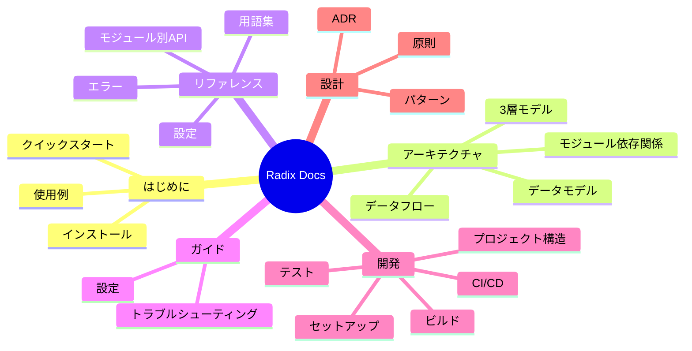

# Radix ドキュメント

Radix ドキュメントへようこそ。このページは全ドキュメントの中央ナビゲーションハブです。

## クイックリンク

| やりたいこと | リンク |
|---|---|
| すぐに使い始めたい | [クイックスタート](getting-started/quickstart.md) |
| アーキテクチャを理解したい | [アーキテクチャ概要](architecture/) |
| APIを調べたい | [APIリファレンス](reference/api/) |
| プロジェクトを設定したい | [設定ガイド](guides/configuration.md) |
| 開発環境を構築したい | [開発環境セットアップ](development/setup.md) |
| 設計判断を理解したい | [ADR](design/adr.md) |

## ドキュメントマップ

## 全ドキュメント

### はじめに
| ドキュメント | 対象読者 | 説明 |
|----------|----------|-------------|
| [インストール](getting-started/installation.md) | ユーザー | 全インストール方法 |
| [クイックスタート](getting-started/quickstart.md) | ユーザー | 5分で動かす |
| [使用例](getting-started/examples.md) | ユーザー/開発者 | 厳選コード例 |

### アーキテクチャ
| ドキュメント | 対象読者 | 説明 |
|----------|----------|-------------|
| [概要](architecture/README.md) | 全員 | 3層アーキテクチャとシステム設計の全体像 |
| [コンポーネント](architecture/components.md) | 開発者 | 内部コンポーネントの詳細（18モジュール） |
| [データモデル](architecture/data-model.md) | 開発者 | コアデータ構造とBitVecの関係 |
| [データフロー](architecture/data-flow.md) | 開発者 | レイヤー間・モジュール間のデータの流れ |
| [モジュール依存関係](architecture/module-dependency.md) | 開発者 | モジュール依存関係グラフ |

### リファレンス
| ドキュメント | 対象読者 | 説明 |
|----------|----------|-------------|
| [APIリファレンス](reference/api/) | 開発者 | モジュール別の完全なAPIドキュメント |
| [設定](reference/configuration.md) | ユーザー/運用者 | lakefile.leanとツールチェインオプション |
| [用語集](reference/glossary.md) | 全員 | ドメイン用語の定義 |
| [エラー](reference/errors.md) | 全員 | エラー型と解決方法 |

### ガイド
| ドキュメント | 対象読者 | 説明 |
|----------|----------|-------------|
| [設定](guides/configuration.md) | ユーザー | Radixの依存関係としての設定方法 |
| [トラブルシューティング](guides/troubleshooting.md) | 全員 | よくある問題と解決策 |

### 開発
| ドキュメント | 対象読者 | 説明 |
|----------|----------|-------------|
| [開発環境セットアップ](development/setup.md) | コントリビューター | 環境構築 |
| [ビルド](development/build.md) | コントリビューター | ビルドシステムガイド |
| [テスト](development/testing.md) | コントリビューター | テスト戦略と実行方法 |
| [プロジェクト構造](development/project-structure.md) | コントリビューター | コードベースのナビゲーション |

### 設計
| ドキュメント | 対象読者 | 説明 |
|----------|----------|-------------|
| [設計原則](design/principles.md) | 全員 | 設計哲学 |
| [設計パターン](design/patterns.md) | 開発者 | 使用パターンとその根拠 |
| [ADR](design/adr.md) | 全員 | アーキテクチャ決定記録の概要 |

## 関連ドキュメント

- [English Documentation](../en/) — 英語ドキュメント
- [設計ドキュメント](design/) — 設計原則、パターン、ADR
- [CHANGELOG](../../CHANGELOG.md) — バージョン履歴
