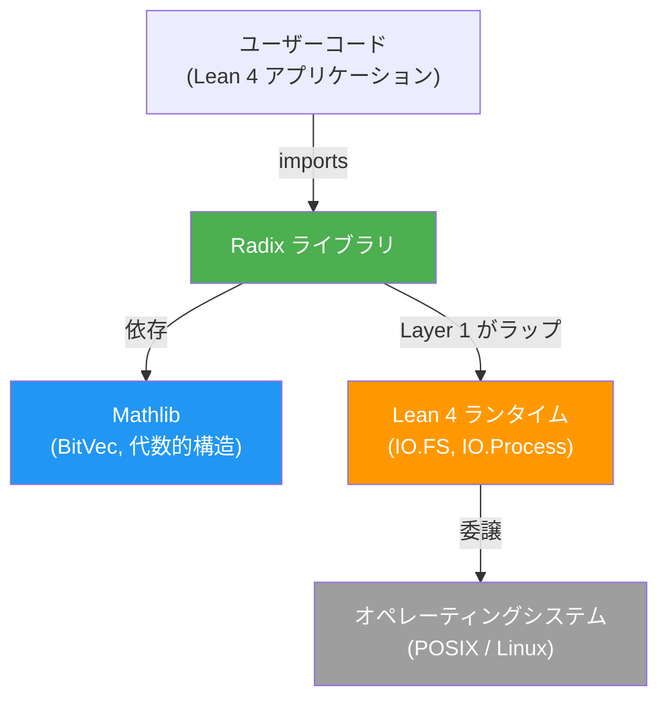
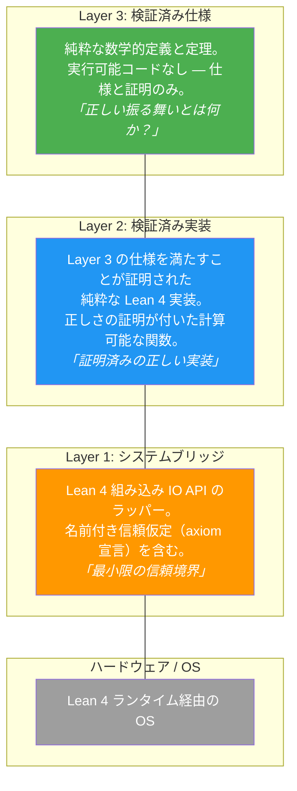
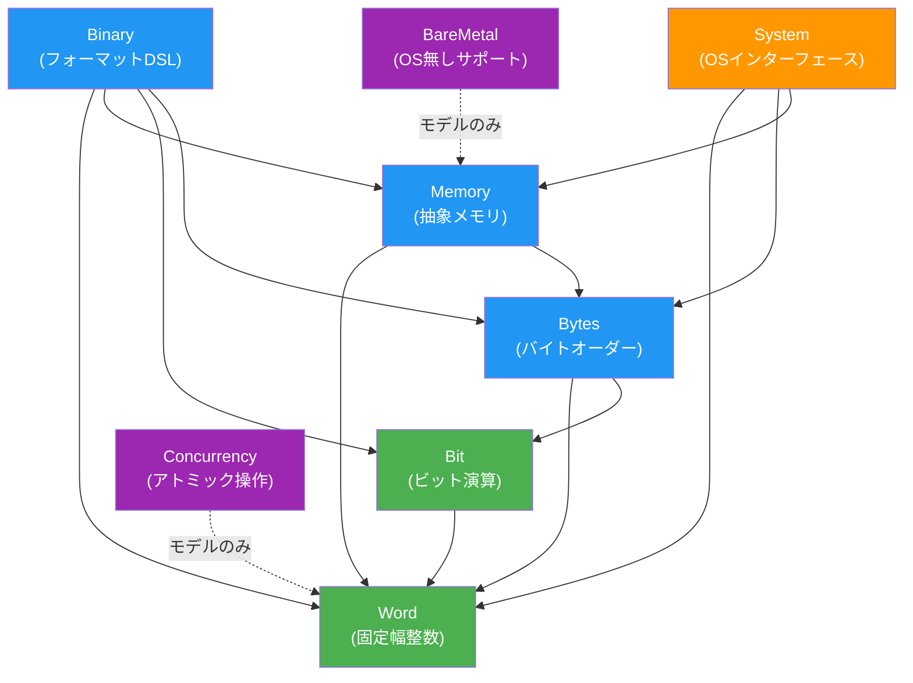

# アーキテクチャ概要

> **対象読者**: 開発者、アーキテクト、コントリビューター

## システムコンテキスト

Radixは、Lean 4向けの形式検証済み低レベルシステムプログラミングライブラリです。C言語と同等の機能 — 固定幅整数、ビット演算、バイトオーダー変換、メモリ抽象化、バイナリフォーマットDSL、システムI/O、並行処理モデル、ベアメタルサポート — を、Mathlibグレードの形式証明とともに提供します。

## 3層アーキテクチャ

Radixは、seL4、CertiKOS、F*/Low*に着想を得た3層アーキテクチャを採用しています：

### レイヤー間の規則

1. Layer 3（仕様）は Layer 2 や Layer 1 を**インポートしてはならない**
2. Layer 2（実装）は Layer 3 を**インポートしなければならない**（仕様への適合を証明するため）
3. Layer 2（実装）は Layer 1 を**インポートしてはならない**（純粋計算、IOなし）
4. Layer 1（ブリッジ）は Layer 3 を**インポートしなければならない**（どの仕様を実装するか明示するため）
5. Layer 1（ブリッジ）は Layer 2 を**インポートしてもよい**（検証済み純粋ロジックの再利用）

### 各モジュールのレイヤーマッピング

| モジュール | Layer 3（仕様） | Layer 2（実装） | Layer 1（ブリッジ） |
|--------|---------------|----------------|-----------------|
| Word | `Word.Spec` | `Word.UInt`, `Word.Int`, `Word.Arith`, `Word.Conv`, `Word.Size` | — |
| Bit | `Bit.Spec` | `Bit.Ops`, `Bit.Scan`, `Bit.Field` | — |
| Bytes | `Bytes.Spec` | `Bytes.Order`, `Bytes.Slice` | — |
| Memory | `Memory.Spec` | `Memory.Model`, `Memory.Ptr`, `Memory.Layout` | — |
| Binary | `Binary.Spec`, `Leb128.Spec` | `Binary.Format`, `Binary.Parser`, `Binary.Serial`, `Leb128` | — |
| System | `System.Spec` | `System.Error`, `System.FD` | `System.IO`, `System.Assumptions` |
| Concurrency | `Concurrency.Spec` | `Concurrency.Ordering`, `Concurrency.Atomic` | `Concurrency.Assumptions` |
| BareMetal | `BareMetal.Spec` | `BareMetal.GCFree`, `BareMetal.Linker`, `BareMetal.Startup` | `BareMetal.Assumptions` |

> **注記:** Word から Binary は**純粋**モジュール（Layer 2-3 のみ）です。System、Concurrency、BareMetal は Layer 1 コンポーネントを持ちます。

## モジュール依存関係グラフ

依存関係は `Word` から上方向に流れます。各上位モジュールは下位モジュール上に構築されます。

## 信頼計算基盤（TCB）

TCBは、正しさが**証明されるのではなく仮定される**コンポーネントの集合です：

| コンポーネント | 状態 |
|-----------|--------|
| Lean 4 コンパイラおよびランタイム | プラットフォームとして受容 |
| Lean 4 組み込み IO 実装 | 名前付き公理で信頼 |
| Lean 4 デフォルト公理（`propext`, `Quot.sound`, `Classical.choice`） | 標準 |
| `System.Assumptions` の `trust_*` 公理 | リリース毎に監査 |
| `Concurrency.Assumptions` の `trust_*` 公理 | リリース毎に監査 |
| `BareMetal.Assumptions` の `trust_*` 公理 | リリース毎に監査 |

**TCBに明示的に含まれないもの：**
- Mathlib（形式検証済み）
- Radix Layer 2-3（証明済み）
- Radix Layer 1 の Lean 4 コード（検証済み。TCBに含まれるのは*IO動作についての仮定*のみ）

## 主要な設計判断

| 判断 | 概要 | ADR |
|----------|---------|-----|
| 3層アーキテクチャ | 検証済みコードの最大化、信頼コードの最小化 | [ADR-001](../design/adr.md) |
| Mathlib BitVec の採用 | `BitVec n` を仕様レベルの正準表現として使用 | [ADR-002](../design/adr.md) |
| 2の補数による符号付き整数 | 符号なし型をラップし、MSBを符号として解釈 | [ADR-003](../design/adr.md) |

## 関連ドキュメント

- [コンポーネント](components.md) — 詳細なコンポーネント分析
- [モジュール依存関係](module-dependency.md) — 完全な依存関係グラフ
- [データモデル](data-model.md) — コアデータ構造
- [データフロー](data-flow.md) — システム内のデータフロー
- [設計原則](../design/principles.md) — 設計哲学
