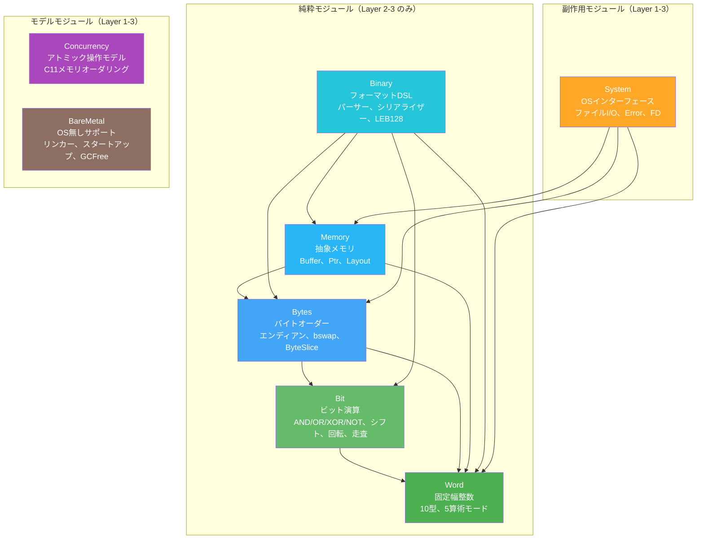

# コンポーネントアーキテクチャ

> **対象読者**: 開発者、コントリビューター

## コンポーネント概要

Radixは13個のモジュールで構成され、それぞれがシステムプログラミングのプリミティブを提供します。全モジュールが3層アーキテクチャ（仕様 → 実装 → ブリッジ）に従います。

下の依存関係図は元の基盤モジュール群に焦点を当てています。v0.2.0 では Alignment、RingBuffer、Bitmap、CRC、MemoryPool が追加されました。

## モジュール詳細

### Word — 固定幅整数型と算術

| サブモジュール | レイヤー | 説明 |
|-----------|-------|-------------|
| `Word.Spec` | 3 | `BitVec n` を用いた数学的仕様 |
| `Word.UInt` | 2 | Lean 4 組み込みをラップした `UInt8`, `UInt16`, `UInt32`, `UInt64` |
| `Word.Int` | 2 | 2の補数による `Int8`, `Int16`, `Int32`, `Int64` |
| `Word.Size` | 2 | `UWord`, `IWord` — プラットフォーム幅型（32/64パラメトリック） |
| `Word.Arith` | 2 | ラッピング、飽和、チェック付き、オーバーフロー付き算術 |
| `Word.Conv` | 2 | ビット幅変換、符号変換、符号拡張 |
| `Word.Lemmas.*` | 3 | 環、オーバーフロー、BitVec、変換の証明 |

**主要設計**: 型は Lean 4 組み込み `UIntN` をラップし、ゼロコスト抽象化を実現（NFR-002）。Layer 3 仕様は `BitVec n` を使用。等価性は `Word.Lemmas.BitVec` で証明済み。

### Bit — ビット演算

| サブモジュール | レイヤー | 説明 |
|-----------|-------|-------------|
| `Bit.Spec` | 3 | ビット演算の仕様 |
| `Bit.Ops` | 2 | AND、OR、XOR、NOT、シフト、回転 |
| `Bit.Scan` | 2 | `clz`、`ctz`、`popcount`、`bitReverse`、`hammingDistance` |
| `Bit.Field` | 2 | `testBit`、`setBit`、`clearBit`、`toggleBit`、`extractBits`、`insertBits` |
| `Bit.Lemmas` | 3 | ブール代数、ド・モルガン、シフト恒等式、フィールドのラウンドトリップ |

**主要設計**: 全シフト/回転操作は `count % bitWidth` でカウントを正規化（Rustセマンティクス、FR-002.1a）。

### Bytes — バイトオーダー操作

| サブモジュール | レイヤー | 説明 |
|-----------|-------|-------------|
| `Bytes.Spec` | 3 | エンディアンとバイトスワップの仕様 |
| `Bytes.Order` | 2 | `bswap`、`toBigEndian`/`fromBigEndian`、`toLittleEndian`/`fromLittleEndian` |
| `Bytes.Slice` | 2 | `ByteSlice` — 境界チェック付き `ByteArray` ビューとエンディアン対応読み取り |
| `Bytes.Lemmas` | 3 | `bswap` 退化、BE/LE ラウンドトリップ、符号付き型のラウンドトリップ |

### Memory — 抽象メモリモデル

| サブモジュール | レイヤー | 説明 |
|-----------|-------|-------------|
| `Memory.Spec` | 3 | 領域、アライメント、分離性の定義 |
| `Memory.Model` | 2 | `Buffer` — 証明付き読み書きの `ByteArray` ベースメモリ |
| `Memory.Ptr` | 2 | `Ptr n` — バイト幅パラメトリックなポインタ抽象化 |
| `Memory.Layout` | 2 | `FieldDesc`、`LayoutDesc` — パックド構造体レイアウト計算 |
| `Memory.Lemmas` | 3 | バッファサイズ保存、領域分離性、アライメントの証明 |

### Binary — バイナリフォーマットDSL

| サブモジュール | レイヤー | 説明 |
|-----------|-------|-------------|
| `Binary.Spec` | 3 | `FormatSpec` と妥当性条件 |
| `Binary.Format` | 2 | `Format` 帰納型 — バイナリレイアウト記述用DSL |
| `Binary.Parser` | 2 | エンディアンサポート付きフォーマット駆動パーサー |
| `Binary.Serial` | 2 | フォーマット駆動シリアライザー |
| `Binary.Leb128` | 2 | LEB128 可変長整数エンコード/デコード |
| `Binary.Leb128.Spec` | 3 | LEB128 数学的仕様 |
| `Binary.Leb128.Lemmas` | 3 | ラウンドトリップ証明、サイズ上限 |
| `Binary.Lemmas` | 3 | フォーマット証明、パーサー/シリアライザーの性質 |

### System — システムコールインターフェース

| サブモジュール | レイヤー | 説明 |
|-----------|-------|-------------|
| `System.Spec` | 3 | `FileState` 状態機械、事前/事後条件、`ReadSpec`/`WriteSpec` |
| `System.Error` | 2 | 10バリアントの `SysError` 帰納型、`fromIOError` マッピング |
| `System.FD` | 2 | `FD`（ファイルディスクリプタ）、`Ownership`、`OpenMode`、`withFile` ブラケット |
| `System.IO` | 1 | `sysRead`、`sysWrite`、`sysSeek`、ファイル便利関数 |
| `System.Assumptions` | 1 | POSIX.1-2024 を引用する `trust_*` 公理 |

### Concurrency — アトミック操作モデル

| サブモジュール | レイヤー | 説明 |
|-----------|-------|-------------|
| `Concurrency.Spec` | 3 | `MemoryOrder`、`MemoryEvent`、`happensBefore`、`isDataRace`、`isLinearizable` |
| `Concurrency.Ordering` | 2 | オーダリング強度比較、強化、結合 |
| `Concurrency.Atomic` | 2 | `AtomicCell`、アトミック load/store/CAS、フェッチ操作 |
| `Concurrency.Lemmas` | 3 | オーダリング強度の証明、DRF証明、線形化可能性 |
| `Concurrency.Assumptions` | 1 | `trust_atomic_word_access`、`trust_cas_atomicity` 等 |

### BareMetal — ベアメタルサポート

| サブモジュール | レイヤー | 説明 |
|-----------|-------|-------------|
| `BareMetal.Spec` | 3 | `Platform`、`RegionKind`、`MemoryMap`、`StartupPhase`、`BootInvariant` |
| `BareMetal.GCFree` | 2 | `Lifetime`、`ForbiddenPattern`、`GCFreeConstraint`、スタック解析 |
| `BareMetal.Linker` | 2 | `LinkerScript`、`Section`、`Symbol`、アドレスアライメント |
| `BareMetal.Startup` | 2 | `StartupAction`、最小/完全スタートアップアクション、バリデーション |
| `BareMetal.Lemmas` | 3 | 領域分離性、メモリマップ、アライメント、スタートアップの証明 |
| `BareMetal.Assumptions` | 1 | `trust_reset_entry`、`trust_bss_zeroed` 等 |

### Alignment — アライメントユーティリティ

| サブモジュール | レイヤー | 説明 |
|-----------|-------|-------------|
| `Alignment.Spec` | 3 | 数学的なアライメント仕様と 2 の冪ルール |
| `Alignment.Ops` | 2 | `alignUp`、`alignDown`、`isAligned`、`alignPadding`、高速パス |
| `Alignment.Lemmas` | 3 | 挟み込み境界、ラウンドトリップ、仕様一致の証明 |

### RingBuffer — 固定容量リングキュー

| サブモジュール | レイヤー | 説明 |
|-----------|-------|-------------|
| `RingBuffer.Spec` | 3 | FIFO キュー状態モデルと不変条件 |
| `RingBuffer.Impl` | 2 | `push`、`pop`、`peek`、`pushForce`、バッチ操作 |
| `RingBuffer.Lemmas` | 3 | 容量保存、FIFO 順序、不変条件保持の証明 |

### Bitmap — 高密度ビット配列

| サブモジュール | レイヤー | 説明 |
|-----------|-------|-------------|
| `Bitmap.Spec` | 3 | 抽象ビット集合モデルと末尾ワード不変条件 |
| `Bitmap.Ops` | 2 | ビット更新、集合演算、popcount、探索操作 |
| `Bitmap.Lemmas` | 3 | ブール代数性質と不変条件保持の証明 |

### CRC — チェックサムアルゴリズム

| サブモジュール | レイヤー | 説明 |
|-----------|-------|-------------|
| `CRC.Spec` | 3 | CRC-32 / CRC-16 の GF(2) 多項式モデル |
| `CRC.Ops` | 2 | テーブル駆動 CRC 実装とストリーミング API |
| `CRC.Lemmas` | 3 | ストリーミング一貫性と代数的正しさの証明 |

### MemoryPool — アロケータモデル

| サブモジュール | レイヤー | 説明 |
|-----------|-------|-------------|
| `MemoryPool.Spec` | 3 | Bump/slab アロケータ状態モデルと安全不変条件 |
| `MemoryPool.Model` | 2 | `Memory.Buffer` を用いる純粋アロケータモデル |
| `MemoryPool.Lemmas` | 3 | 容量追跡、リセット正しさ、二重解放防止の証明 |

## 関連ドキュメント

- [アーキテクチャ概要](README.md) — ハイレベルアーキテクチャ
- [モジュール依存関係](module-dependency.md) — 依存関係グラフ
- [データモデル](data-model.md) — コアデータ構造
- [APIリファレンス](../reference/api/) — モジュール別の詳細API
