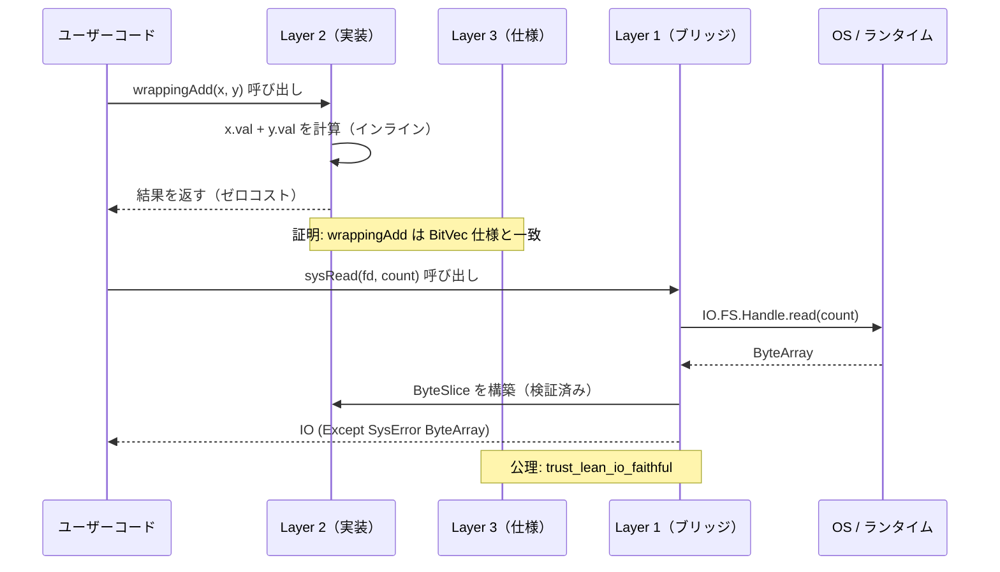
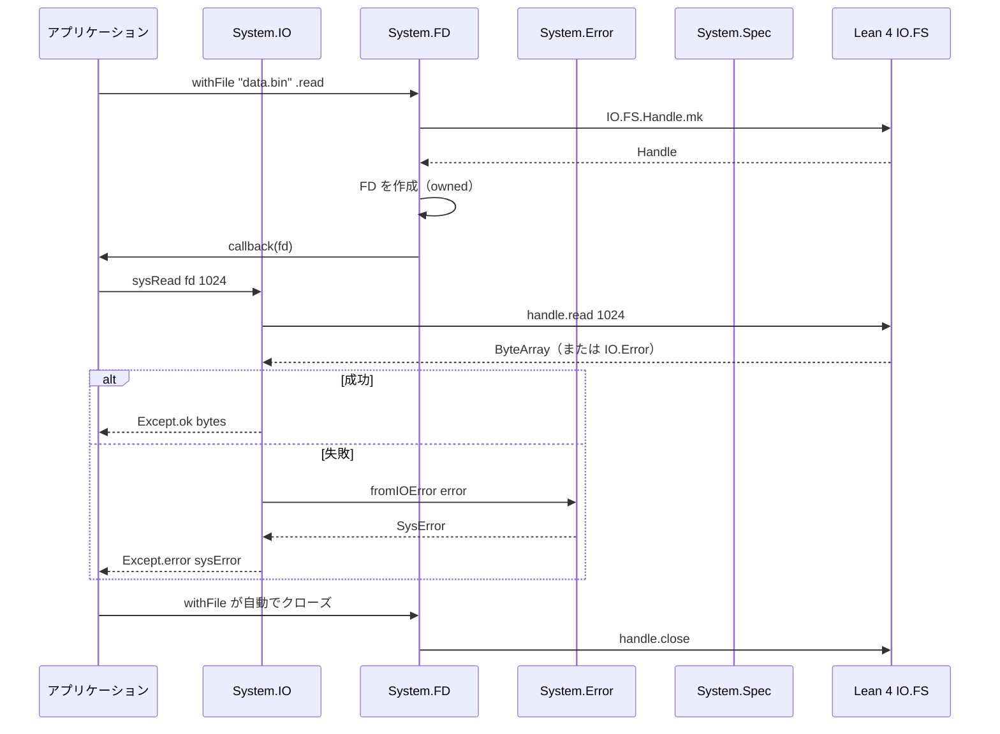
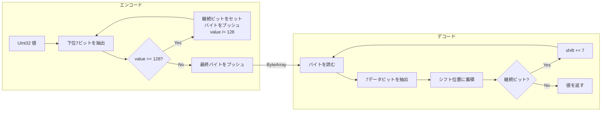
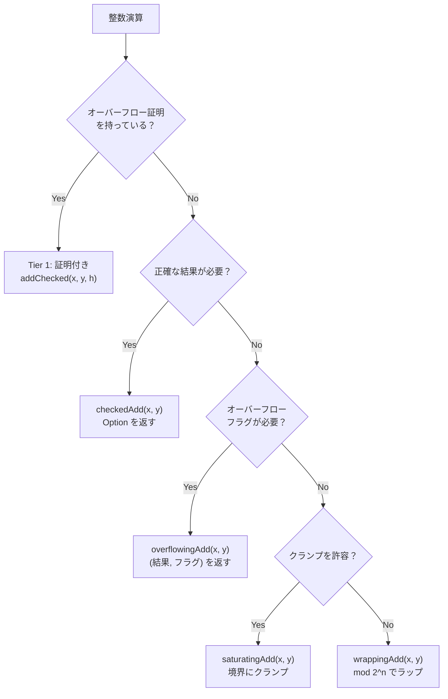
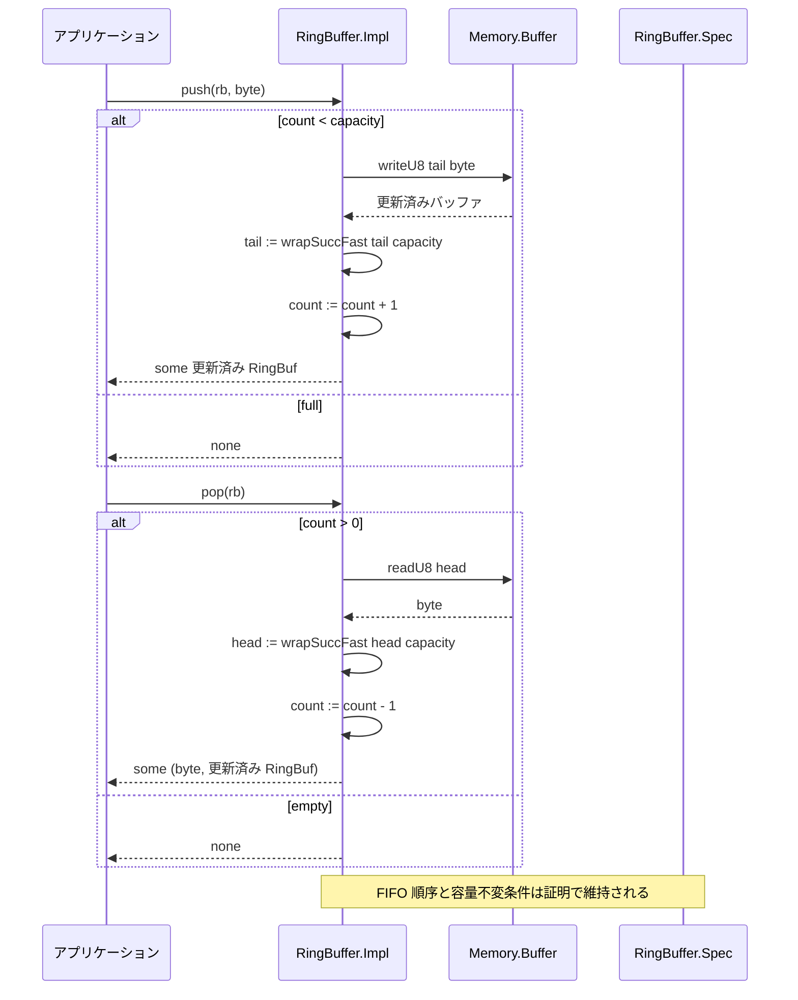
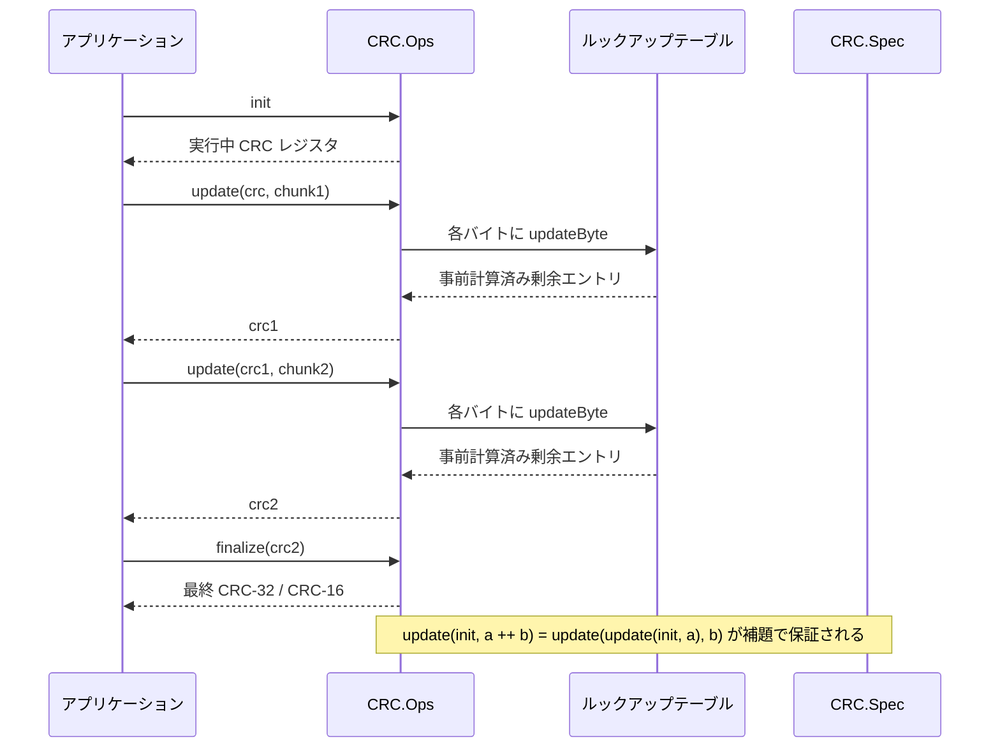

# データフロー

> **対象読者**: 開発者、コントリビューター

## Layer 3 → Layer 2 → Layer 1 フロー

Radixのデータは3層アーキテクチャを通じて流れます。仕様（Layer 3）が正しさを定義し、実装（Layer 2）が計算を行い、ブリッジ（Layer 1）がOSに接続します。



## ファイル読み取りフロー（エンドツーエンド）



## バイナリ パース/シリアライズ ラウンドトリップ

```mermaid
sequenceDiagram
    participant App as アプリケーション
    participant Fmt as Binary.Format
    participant Ser as Binary.Serial
    participant Par as Binary.Parser
    participant Buf as Memory.Buffer

    App->>Fmt: フォーマット定義（u16be, u32le, pad 2）
    App->>Ser: serializeFormat format values
    Ser->>Buf: エンディアン付きフィールド書き込み
    Buf-->>Ser: ByteArray
    Ser-->>App: ByteArray（シリアライズ済み）

    App->>Par: parseFormatExact data format
    Par->>Buf: エンディアン付きフィールド読み取り
    Buf-->>Par: FieldValues
    Par-->>App: List FieldValue（パース済み）

    Note over Ser,Par: exact parse は余剰バイトを拒否し、prefix parse は parsePrefix を使う
```

## LEB128 エンコード/デコードフロー



## 算術モード選択



## リングバッファの push/pop フロー



## CRC ストリーミングフロー



## 関連ドキュメント

- [アーキテクチャ概要](README.md) — 3層モデル
- [コンポーネント](components.md) — モジュール詳細
- [モジュール依存関係](module-dependency.md) — 依存関係グラフ
