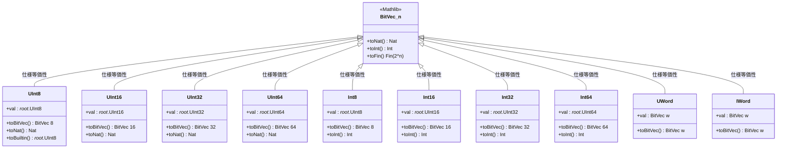
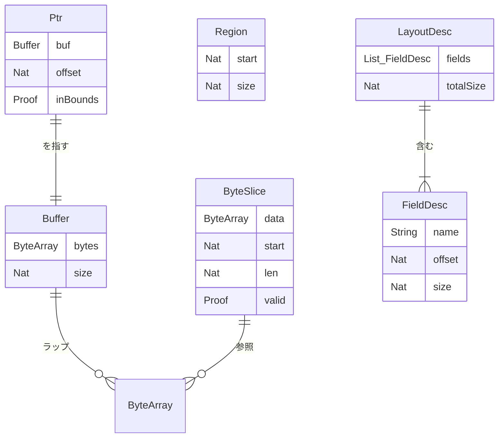
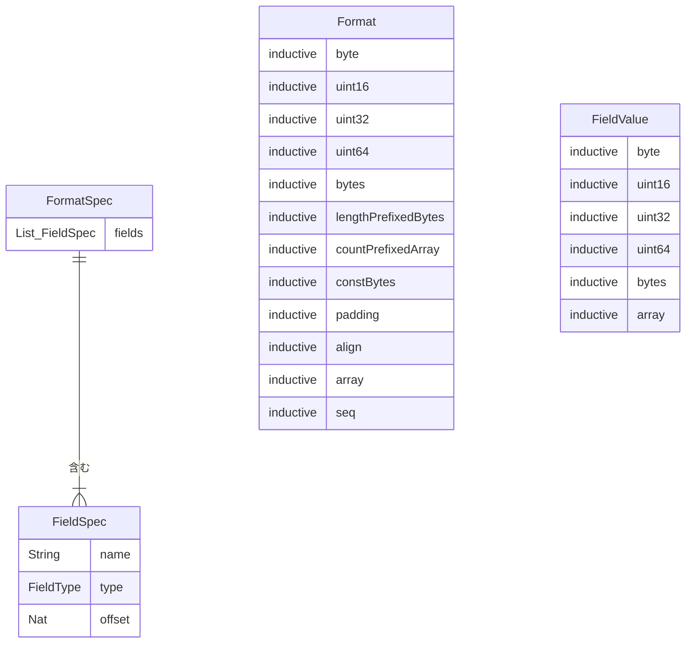
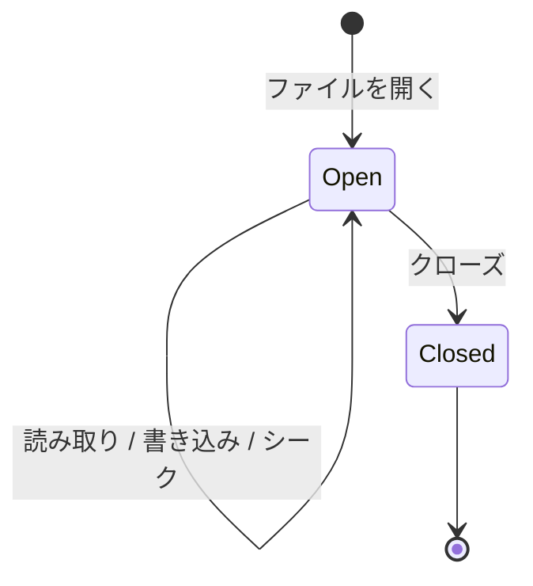
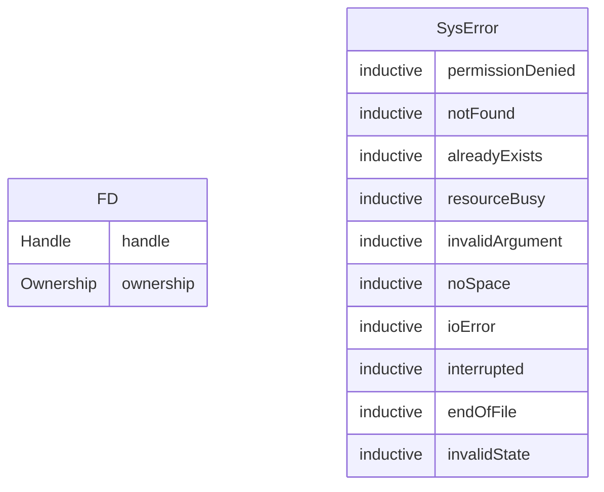
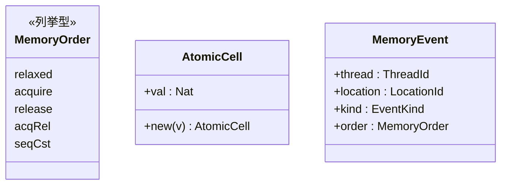
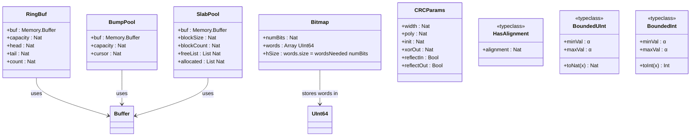

# データモデル

> **対象読者**: 開発者、コントリビューター

## コア型階層

## メモリデータ構造

## バイナリフォーマット型

## システム型

## 並行処理型

## v0.2.0 のデータ構造

これらは v0.2.0 の主要追加型です。`RingBuf` は FIFO キュー状態、`Bitmap` は高密度ビット格納、`BumpPool` と `SlabPool` はアロケータ状態、`CRCParams` は CRC アルゴリズムの設定、`HasAlignment`・`BoundedUInt`・`BoundedInt` は幅非依存 API の型クラスを表します。

## 関連ドキュメント

- [アーキテクチャ概要](README.md) — システム設計のコンテキスト
- [コンポーネント](components.md) — モジュール詳細
- [APIリファレンス](../reference/api/) — 詳細なAPI
