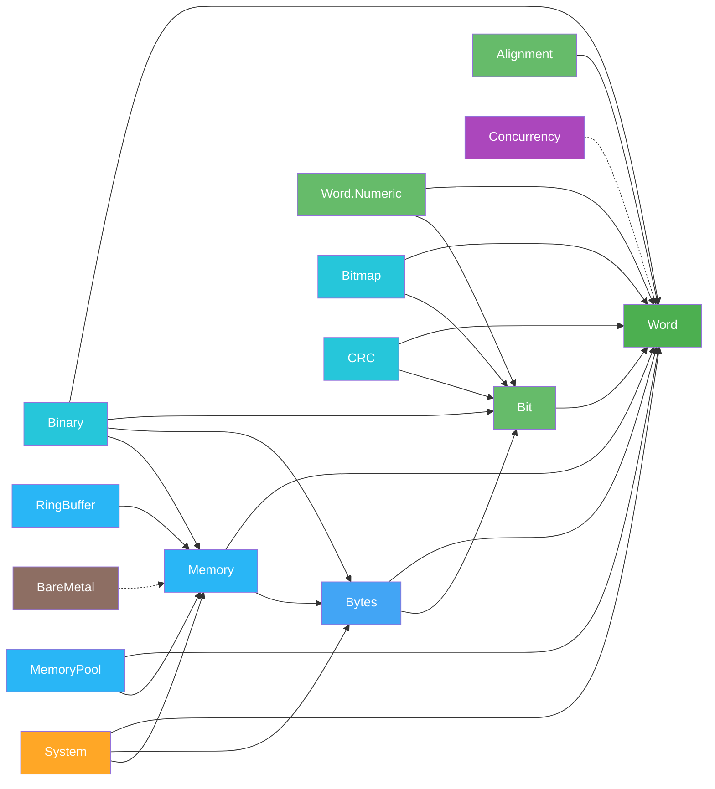

# モジュール依存関係グラフ

> **対象読者**: 開発者、コントリビューター

## 高レベル依存関係

## 詳細サブモジュール依存関係

```mermaid
graph TD
    subgraph "Word モジュール"
        WSpec["Word.Spec<br/>(Layer 3)"]
        WUInt["Word.UInt<br/>(Layer 2)"] --> WSpec
        WInt["Word.Int<br/>(Layer 2)"] --> WUInt
        WSize["Word.Size<br/>(Layer 2)"] --> WSpec
        WArith["Word.Arith<br/>(Layer 2)"] --> WUInt
        WArith --> WInt
        WArith --> WSize
        WConv["Word.Conv<br/>(Layer 2)"] --> WUInt
        WConv --> WInt
        WConv --> WSize
        WNum["Word.Numeric<br/>(Layer 2)"] --> WUInt
        WNum --> WInt
        WNum --> WSize
        WNum --> BOps
        WNum --> BScan
        WNum --> BField
        WLemmas["Word.Lemmas.*<br/>(Layer 3)"] --> WArith
        WLemmas --> WConv
        WLemmas --> WNum
    end
    subgraph "Bit モジュール"
        BSpec["Bit.Spec<br/>(Layer 3)"]
        BOps["Bit.Ops<br/>(Layer 2)"] --> WUInt
        BOps --> WInt
        BOps --> WSize
        BScan["Bit.Scan<br/>(Layer 2)"] --> BOps
        BField["Bit.Field<br/>(Layer 2)"] --> BOps
        BLemmas["Bit.Lemmas<br/>(Layer 3)"] --> BScan
        BLemmas --> BField
    end
    subgraph "Bytes モジュール"
        BySpec["Bytes.Spec<br/>(Layer 3)"]
        ByOrd["Bytes.Order<br/>(Layer 2)"] --> WUInt
        ByOrd --> WInt
        BySlice["Bytes.Slice<br/>(Layer 2)"] --> ByOrd
        ByLemmas["Bytes.Lemmas<br/>(Layer 3)"] --> BySlice
    end
    subgraph "Memory モジュール"
        MSpec["Memory.Spec<br/>(Layer 3)"]
        MModel["Memory.Model<br/>(Layer 2)"] --> ByOrd
        MPtr["Memory.Ptr<br/>(Layer 2)"] --> MModel
        MLay["Memory.Layout<br/>(Layer 2)"]
        MLemmas["Memory.Lemmas<br/>(Layer 3)"] --> MModel
        MLemmas --> MPtr
        MLemmas --> MLay
    end
    subgraph "Binary モジュール"
        BnSpec["Binary.Spec<br/>(Layer 3)"]
        BnFmt["Binary.Format<br/>(Layer 2)"] --> BnSpec
        BnParser["Binary.Parser<br/>(Layer 2)"] --> BnFmt
        BnParser --> BySlice
        BnSerial["Binary.Serial<br/>(Layer 2)"] --> BnFmt
        BnLeb["Binary.Leb128<br/>(Layer 2)"] --> WUInt
        BnLeb --> WInt
        BnLemmas["Binary.Lemmas<br/>(Layer 3)"] --> BnParser
        BnLemmas --> BnSerial
    end
    subgraph "System モジュール"
        SSpec["System.Spec<br/>(Layer 3)"]
        SErr["System.Error<br/>(Layer 2)"]
        SFD["System.FD<br/>(Layer 2)"] --> SErr
        SIO["System.IO<br/>(Layer 1)"] --> SFD
        SIO --> SSpec
        SAssume["System.Assumptions<br/>(Layer 1)"] --> SSpec
    end

    subgraph "v0.2.0 モジュール"
        ASpec["Alignment.Spec<br/>(Layer 3)"]
        AOps["Alignment.Ops<br/>(Layer 2)"] --> ASpec
        AOps --> WUInt
        ALemmas["Alignment.Lemmas<br/>(Layer 3)"] --> AOps

        RBSpec["RingBuffer.Spec<br/>(Layer 3)"]
        RBImpl["RingBuffer.Impl<br/>(Layer 2)"] --> RBSpec
        RBImpl --> MModel
        RBLemmas["RingBuffer.Lemmas<br/>(Layer 3)"] --> RBImpl

        BmSpec["Bitmap.Spec<br/>(Layer 3)"]
        BmOps["Bitmap.Ops<br/>(Layer 2)"] --> BmSpec
        BmOps --> WUInt
        BmOps --> BOps
        BmOps --> BScan
        BmLemmas["Bitmap.Lemmas<br/>(Layer 3)"] --> BmOps

        CRCSpec["CRC.Spec<br/>(Layer 3)"]
        CRCOps["CRC.Ops<br/>(Layer 2)"] --> CRCSpec
        CRCOps --> WUInt
        CRCOps --> WArith
        CRCOps --> BOps
        CRCLemmas["CRC.Lemmas<br/>(Layer 3)"] --> CRCOps

        MPSpec["MemoryPool.Spec<br/>(Layer 3)"]
        MPModel["MemoryPool.Model<br/>(Layer 2)"] --> MPSpec
        MPModel --> MModel
        MPModel --> WUInt
        MPLemmas["MemoryPool.Lemmas<br/>(Layer 3)"] --> MPModel
    end
```

## 外部依存関係

| 依存関係 | ソース | 目的 |
|------------|--------|---------|
| **Mathlib** | `leanprover-community/mathlib4` | `BitVec n`、代数的構造、証明タクティクス |
| **Batteries** | `leanprover-community/batteries` | 標準ライブラリ拡張（Mathlib経由で推移的） |
| **Plausible** | `leanprover-community/plausible` | プロパティベーステスト（Mathlib経由で推移的） |

## 依存関係の原則

- **Word** は内部依存関係ゼロ — これが基盤
- **Word.Numeric** は Word に幅非依存 API を追加し、Bit 演算も再利用
- **Bit** は Word の型にのみ依存（Word.Arith には依存しない）
- **Bytes** は Word と Bit に依存
- **Memory** は Word と Bytes に依存（Bit には直接依存しない）
- **Binary** は Word、Bit、Bytes、Memory に依存
- **Alignment** は Word のみに依存
- **RingBuffer** は Memory に依存
- **Bitmap** は Word と Bit に依存
- **CRC** は Word、Word.Arith、Bit に依存
- **MemoryPool** は Memory と Word に依存
- **System** は Word、Bytes、Memory に依存
- **Concurrency** と **BareMetal** は独立したモデルモジュール

## 関連ドキュメント

- [アーキテクチャ概要](README.md) — ハイレベルアーキテクチャ
- [コンポーネント](components.md) — コンポーネント詳細
- [データフロー](data-flow.md) — レイヤー間のデータフロー
