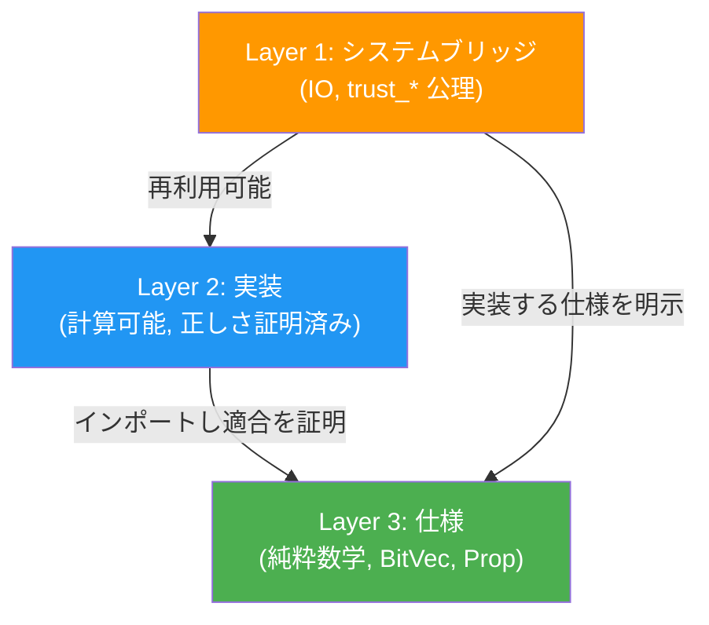
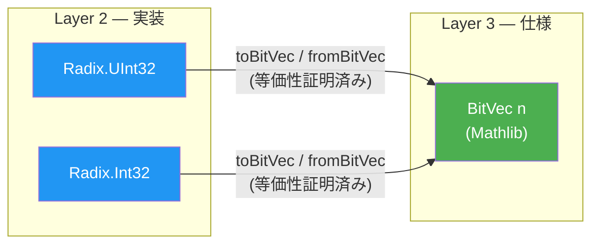

# アーキテクチャ決定記録（ADR）

> **対象読者**: 全員

## 概要

アーキテクチャ決定記録（ADR）は、Radix開発中に行われた重要なアーキテクチャ上の決定を記録します。各ADRは、コンテキスト、決定そのもの、検討した代替案、結果を文書化します。

ADRの正式なソースファイルは [`spec/adr/`](../../../spec/adr/) で管理されています。

## ADR一覧

| ADR | タイトル | ステータス | 概要 |
|-----|-------|--------|---------|
| [ADR-001](#adr-001-3層アーキテクチャ) | 3層アーキテクチャ | Proposed | 検証済みコードの最大化、TCBの最小化 |
| [ADR-002](#adr-002-mathlib-bitvec-の採用) | Mathlib BitVec の採用 | Proposed | `BitVec n` を仕様レベルの正準表現として使用 |
| [ADR-003](#adr-003-2の補数ラッパーによる符号付き整数) | 2の補数ラッパーによる符号付き整数 | Proposed | ゼロコスト抽象化のため符号付き型が符号なしストレージをラップ |

---

## ADR-001: 3層アーキテクチャ

**ステータス:** Proposed

**コンテキスト:** Radixは形式検証済み低レベルプリミティブを提供しつつ、実際のオペレーティングシステムとのインターフェースも持つ。形式検証はFFI呼び出しには及ばない —  検証済みコードと信頼コードの間には常に境界がある。アーキテクチャは検証済み部分を最大化し、信頼部分を最小化しなければならない。

**決定:** 3層アーキテクチャを採用：

- **Layer 3（検証済み仕様）** — 純粋な数学的仕様と定理。実行可能コードなし。
- **Layer 2（検証済み実装）** — Layer 3 仕様を満たす証明付きの純粋 Lean 4 実装。
- **Layer 1（システムブリッジ）** — 組み込みIO APIをラップする Lean 4 コード。IO動作が `System.Spec` と一致することを主張する名前付き信頼仮定（`axiom` 宣言）を含む。



**インポート規則:**
| レイヤー | インポート可能 |
|-------|-----------|
| Layer 3（仕様） | なし（自己完結） |
| Layer 2（実装） | Layer 3 のみ |
| Layer 1（ブリッジ） | Layer 3、オプションで Layer 2 |

**却下された代替案:**
1. **単一レイヤー** — TCB境界が不明確、FFI変更が証明を破壊。
2. **2レイヤー**（仕様+実装を統合） — 実装詳細が仕様に漏洩、独立した推論が困難。
3. **F\*スタイル抽出**（Lean 4で検証、Cに抽出） — Lean 4→C抽出パイプラインが存在しない。C-001に違反。

**根拠:** seL4とCertiKOSで成功実績あり。明確なTCB境界を提供し、独立した検証を可能にする。

**結果:** 管理するファイルは増えるが、TCBの明確な監査証跡（`@[extern]` + `trust_*` 公理を検査）。

> **ソース:** [`spec/adr/0001-three-layer-architecture.md`](../../../spec/adr/0001-three-layer-architecture.md)

---

## ADR-002: Mathlib BitVec の採用

**ステータス:** Proposed

**コンテキスト:** Lean 4 Mathlib は `BitVec n`（固定幅ビットベクトル型）を提供し、算術/ビット演算サポートが成長中。Radixは基盤として固定幅整数型が必要。

**決定:** Mathlibの `BitVec n` を**仕様レベル**の正準表現（Layer 3）として使用。Layer 2 の Radix 型は `BitVec` 操作と等価であることが証明されたラッパーとして定義。



**却下された代替案:**
1. **`BitVec` を直接使用** — APIの制御不可。Mathlibアップグレードで全てが壊れる可能性。
2. **完全に独立した実装** — 大量の証明重複。コミュニティの投資を失う。

**根拠:** Mathlibの `BitVec` は活発にメンテナンスされ、証明カバレッジが成長中。ただし、APIは数学的推論向けであり、システムプログラミング向けではない。Radixラッパー型はMathlib証明を活用しつつ、システムフレンドリーなAPIを提供。

**結果:**
- Mathlibが必須依存関係
- Radix型は `BitVec` 等価性の証明を伴う
- ユーザーは Mathlib の補題が直接必要な場合に `BitVec` に落とせる

> **ソース:** [`spec/adr/0002-build-on-mathlib-bitvec.md`](../../../spec/adr/0002-build-on-mathlib-bitvec.md)

---

## ADR-003: 2の補数ラッパーによる符号付き整数

**ステータス:** Proposed

**コンテキスト:** Lean 4 には組み込みの符号付き固定幅整数型がない。`Int` は任意精度。システムプログラミングにはCの `int8_t`-`int64_t` と一致する2の補数セマンティクスの `Int8`-`Int64` が必要。

**決定:** 符号付き整数型を Lean 4 組み込みの符号なし整数型をラップする構造体として定義：

```lean
structure Int8 where
  val : UInt8

structure Int32 where
  val : _root_.UInt32
```

符号はMSBにより決定。操作は Lean 4 組み込み `UIntX` 操作に直接マッピング（単一C命令にコンパイル）され、`BitVec` 解釈モデルに対する正しさが証明済み。

**却下された代替案:**
1. **境界証明付き `Int` のラッパー** — 例: `(val : Int) (h : -128 ≤ val ∧ val ≤ 127)`。全操作に境界証明が必要。ビット互換でない。NFR-002（ゼロコスト抽象化）を完全に失敗。
2. **`BitVec` のラッパー** — Lean 4 コンパイラは現在 `BitVec` をCプリミティブに直接マッピングしない。全算術操作がオブジェクトを割り当て、性能を破壊。

**根拠:** ゼロコスト抽象化（NFR-002）はハード制約。Lean 4 組み込み `UIntX` 型のラップが、基本算術がCPU命令に直接コンパイルされることを保証する唯一の方法。証明レイヤーで符号付きと符号なしの両方の型の共通基盤として `BitVec` を使用することで、ビット演算の共有証明が可能。

**結果:**
- `Int8.bits` と `UInt8.bits` は同じ型（`BitVec 8`）
- 符号付き/符号なし間のキャストは無料（同じビット、異なる解釈）
- 符号依存操作（比較、除算、算術右シフト）には個別の実装と証明が必要

> **ソース:** [`spec/adr/0003-signed-integers-twos-complement.md`](../../../spec/adr/0003-signed-integers-twos-complement.md)

---

## テンプレート

新規ADRには [`spec/adr/template.md`](../../../spec/adr/template.md) のテンプレートを使用。

## 関連ドキュメント

- [設計原則](principles.md) — 設計哲学
- [設計パターン](patterns.md) — これらの決定から導出されたパターン
- [アーキテクチャ概要](../architecture/) — システム設計
