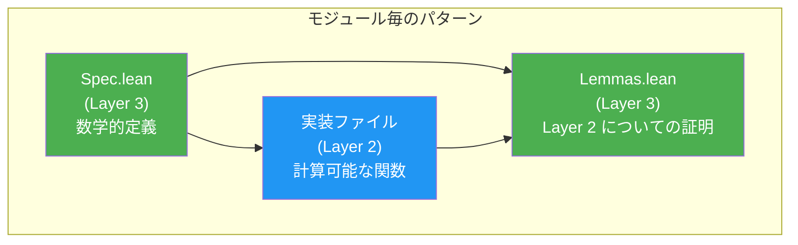

# 設計パターン

> **対象読者**: 開発者、コントリビューター

## 概要

Radixでは複数の繰り返し現れる設計パターンが使用されています。これらのパターンを理解することで、コードベースの読解とコントリビューションが容易になります。

## 3層パターン

全モジュールが同じ構造分解に従います：



**パターン:**
1. `Spec.lean` が正しい振る舞いの意味を定義（純粋数学、`BitVec`、述語）
2. 実装ファイルが Lean 4 プリミティブをラップする計算可能な関数を提供
3. `Lemmas.lean` が実装が仕様を満たすことを証明

**例:**
- `Word.Spec` → `Word.UInt` + `Word.Arith` → `Word.Lemmas.Ring`
- `Bit.Spec` → `Bit.Ops` → `Bit.Lemmas`
- `Bytes.Spec` → `Bytes.Order` → `Bytes.Lemmas`

## ラッパーパターン

Radixの型はゼロコスト抽象化のために Lean 4 組み込み型をラップ：

```lean
structure UInt32 where
  val : _root_.UInt32    -- Lean 4 組み込み

@[inline] def UInt32.wrappingAdd (x y : UInt32) : UInt32 :=
  ⟨x.val + y.val⟩       -- 組み込み算術に委譲
```

**動機:** Lean 4 の組み込み `UInt32` は C の `uint32_t` にコンパイルされる。`BitVec` を直接使用する代わりにラップすることで、操作が単一のCPU命令にコンパイルされることを保証（NFR-002）。

**適用先:** 全10整数型（`UInt8`-`UInt64`、`Int8`-`Int64`、`UWord`、`IWord`）。

## 2の補数パターン（ADR-003）

符号付き型は符号なしストレージをラップ：

```lean
structure Int32 where
  val : _root_.UInt32    -- UInt32 と同じストレージ
```

符号はMSBにより決定。符号付き比較にはビット演算を使用：

```lean
@[inline] def Int32.slt (a b : Int32) : Bool :=
  -- 符号ビットとXORして負数の比較を反転
```

**利点:** ヒープ割り当てなし。`Int` ボクシングなし。Cと同じメモリレイアウト。

## 仕様等価性パターン

全Radix操作に対応する `BitVec` 仕様があり、等価性が証明済み：

```
Radix.UInt32.wrappingAdd x y
  ↕ (toBitVec / fromBitVec, Word.Lemmas.BitVec で証明)
BitVec.add (x.toBitVec) (y.toBitVec)
  ↕ (Word.Spec で定義)
Radix.Word.Spec.wrappingAdd
```

**証明の形:**
```lean
theorem wrappingAdd_toBitVec (x y : UInt32) :
    (wrappingAdd x y).toBitVec = x.toBitVec + y.toBitVec
```

## 階層化APIパターン

境界付き操作を提供するモジュールは2段階を公開：

```lean
-- Tier 1: 証明付き（ランタイムコストゼロ）
def Buffer.readU8 (buf : Buffer) (offset : Nat)
    (h : offset < buf.size) : UInt8

-- Tier 2: チェック付き（Option を返す）
def Buffer.checkedReadU8 (buf : Buffer) (offset : Nat) : Option UInt8 :=
  if h : offset < buf.size then some (buf.readU8 offset h) else none
```

**パターン:** Tier 2 は動的境界チェック付きで Tier 1 の上に実装。Tier 1 の証明は自動的に Tier 2 にも適用される。

**適用先:** `Buffer`（読み書き）、`ByteSlice`（読み取り/サブスライス）、`Ptr`（逆参照）、`Word.Arith`（証明付き算術）。

## 算術モードパターン

全10整数型が統一APIで5つの算術モードをサポート：

| モード | サフィックス | 戻り値型 | オーバーフロー時の動作 |
|------|--------|-------------|---------------------|
| 証明付き | `addChecked`* | `T`（証明パラメータ付き） | 証明が失敗するとコンパイルエラー |
| ラッピング | `wrappingAdd` | `T` | 結果を mod 2^n |
| 飽和 | `saturatingAdd` | `T` | MIN/MAX にクランプ |
| チェック付き | `checkedAdd` | `Option T` | オーバーフローで `none` |
| オーバーフロー付き | `overflowingAdd` | `T × Bool` | ラッピング結果 + フラグ |

*注: Tier 1 `addChecked` は非オーバーフローの証明をパラメータとして要求。

**パターン:** 各モードが各型×各操作（add、sub、mul、div、rem）に定義され、符号付きバリアントは2の補数のエッジケースを処理。

## ブラケットパターン（リソース安全性）

システムリソースはRAIIスタイルのブラケットパターンを使用：

```lean
def FD.withFile (path : String) (mode : OpenMode) (f : FD → IO α) : IO α
  -- ファイルを開く → FDをコールバックに渡す → 終了時にクローズ（エラー時も）
```

**保証:** ファイルディスクリプタは、コールバックが例外を投げた場合でも必ずクローズされる。リソースリークを防止。

## エラーモデリングパターン

システム操作は例外を投げる代わりに `IO (Except SysError α)` を返す：

```lean
def sysRead (fd : FD) (count : Nat) : IO (Except SysError ByteArray)
```

**根拠:** `Except` による明示的エラー処理により、エラーパスが型シグネチャで可視化。隠れた例外なし。`liftIO` コンビネータが Lean 4 のIO例外を `SysError` にキャプチャ：

```lean
def liftIO (action : IO α) : IO (Except SysError α)
```

## 信頼公理パターン

Layer 1 公理は厳格なフォーマットに従う：

```lean
/-- 外部仕様を引用する説明。
    参照: POSIX.1-2024, Section X.Y.Z -/
axiom trust_<name> (params : Types) : Prop
```

**規則:**
- `Prop` 型（計算可能なコンテンツなし）
- `trust_` プレフィックスでTCB監査性を確保
- ドキュメントストリングに外部仕様の引用
- `Assumptions.lean` ファイルに収集

## 退化パターン

いくつかの操作は自身の逆であり、これが形式的に証明済み：

| 操作 | 証明 |
|-----------|-------|
| `bnot (bnot x) = x` | `Bit.Lemmas` |
| `bswap (bswap x) = x` | `Bytes.Lemmas` |
| `bitReverse (bitReverse x) = x` | `Bit.Lemmas` |
| `fromBitVec (toBitVec x) = x` | `Word.Lemmas.BitVec` |
| `fromBigEndian (toBigEndian x) = x` | `Bytes.Lemmas` |

これらのラウンドトリップ証明はエンコード/デコード操作の正しさにとって不可欠。

## ラウンドトリップパターン

エンコード/デコードのペアが逆であることが証明済み：

| ペア | 証明モジュール |
|------|-------------|
| `encodeU32` / `decodeU32` | `Binary.Leb128.Lemmas` |
| `encodeU64` / `decodeU64` | `Binary.Leb128.Lemmas` |
| `encodeS32` / `decodeS32` | `Binary.Leb128.Lemmas` |
| `encodeS64` / `decodeS64` | `Binary.Leb128.Lemmas` |
| `toBigEndian` / `fromBigEndian` | `Bytes.Lemmas` |
| `toLittleEndian` / `fromLittleEndian` | `Bytes.Lemmas` |
| `serializeFormat` / `parseFormatExact` | `Binary.Spec` で仕様化。ヘッダ prefix 用には `parsePrefix` を使う |
| `toBitVec` / `fromBitVec` | `Word.Lemmas.BitVec` |

## 関連ドキュメント

- [設計原則](principles.md) — 設計哲学
- [アーキテクチャ](../architecture/) — システム設計
- [ADR](adr.md) — 決定記録
