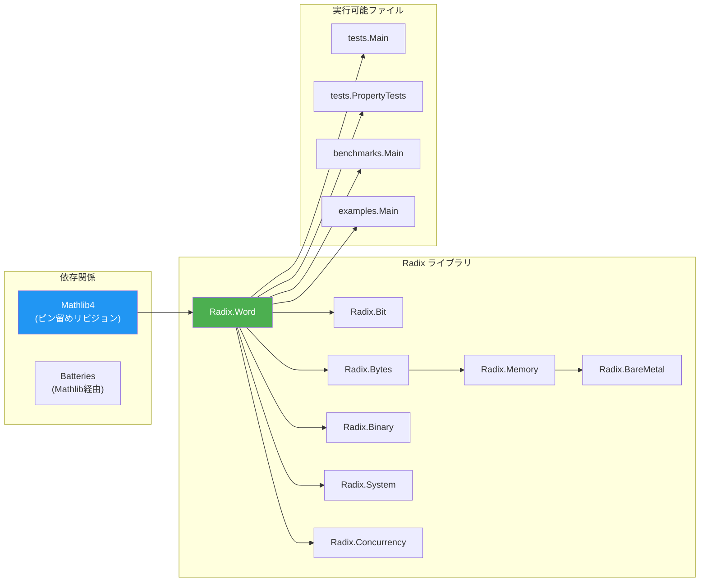

# ビルドシステム

> **対象読者**: コントリビューター

## 概要

Radixは**Lake**（Lean 4 の組み込みビルドシステム）を使用します。プロジェクト設定は `lakefile.lean` にあります。

## 設定

```lean
import Lake
open Lake DSL

package radix where
  leanOptions := #[
    ⟨`autoImplicit, false⟩
  ]

@[default_target]
lean_lib Radix where
  srcDir := "."

require mathlib from git
  "https://github.com/leanprover-community/mathlib4" @ "06e947358d88e36af006f915f79a04a10fd43cc4"

@[default_target]
lean_exe test where
  root := `tests.Main

lean_exe proptest where
  root := `tests.PropertyTests

lean_exe bench where
  root := `benchmarks.Main

lean_exe examples where
  root := `examples.Main
```

## ターゲット

| ターゲット | 種類 | ルートモジュール | コマンド |
|--------|------|-------------|---------|
| `Radix` | ライブラリ（デフォルト） | `Radix` | `lake build` |
| `test` | 実行可能（デフォルト） | `tests.Main` | `lake build test && lake exe test` |
| `proptest` | 実行可能 | `tests.PropertyTests` | `lake build proptest && lake exe proptest` |
| `bench` | 実行可能 | `benchmarks.Main` | `lake build bench && lake exe bench` |
| `examples` | 実行可能 | `examples.Main` | `lake build examples && lake exe examples` |

> **注記:** `Radix` と `test` が両方とも `@[default_target]` なので、`lake build` は両方をビルドします。

## ビルドパイプライン



## 主要コマンド

```bash
# ライブラリのみビルド
lake build Radix

# 全てビルド（ライブラリ + テスト）
lake build

# 全ビルド成果物をクリーン
lake clean

# 依存関係の更新（Mathlibを再取得）
lake update

# 特定の実行可能ファイルを実行
lake exe test
lake exe proptest
lake exe bench
lake exe examples
```

## インクリメンタルビルド

Lakeはインクリメンタルコンパイルを行います。初回ビルド後は、変更されたファイルとその依存先のみが再コンパイルされます。`Spec.lean` ファイルの変更は、対応する `Lemmas.lean` と全下流モジュールの再コンパイルをトリガーする可能性があります。

## Mathlib 依存関係

Mathlibは `lakefile.lean` でGitリビジョンによりピン留め：

```lean
require mathlib from git
  "https://github.com/leanprover-community/mathlib4" @ "06e947358d88e36af006f915f79a04a10fd43cc4"
```

Mathlibを更新するには：
1. リビジョンハッシュを変更
2. `lean-toolchain` が新しいMathlibバージョンと互換であることを確認
3. `lake update && lake build` を実行
4. 破壊的変更を修正

> **警告:** Mathlibの更新は破壊的変更を引き起こすことがあります。更新後は必ず全テストスイートを実行してください。

## ベンチマーク

ベンチマーク実行可能ファイルは操作スループットを ns/op で計測：

```bash
lake exe bench
```

### コンパイラ最適化対策（NFR-002.2）

ベンチマークはコンパイラ最適化に対する3つの対策を実装：

1. **アキュムレータシンク**: 各イテレーションの結果を次に渡し、`@[noinline]` 関数で出力
2. **入力依存オペランド**: イテレーション毎にインデックスされるPRNG事前生成配列
3. **バリデーションステップ**: 最終アキュムレータを出力。0は無効な計測を示す

### Cベースライン

C相当品が `benchmarks/baseline.c` で提供：

```bash
gcc -O2 -fno-builtin -o baseline benchmarks/baseline.c
./baseline
```

結果テンプレート: `benchmarks/results/template.md`

## 関連ドキュメント

- [セットアップ](setup.md) — 開発環境セットアップ
- [テスト](testing.md) — テスト戦略
- [設定リファレンス](../reference/configuration.md) — 全設定オプション
