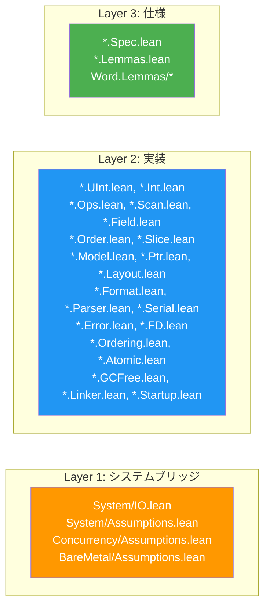

# プロジェクト構造

> **対象読者**: コントリビューター

## ディレクトリツリー

```
radix/
├── lakefile.lean              # Lake ビルド設定
├── lean-toolchain             # Lean 4 バージョンピン（v4.29.0-rc4）
├── Radix.lean                 # ルートインポート（全8モジュールをインポート）
├── CHANGELOG.md               # バージョン履歴
├── TODO.md                    # 実装トラッキング
├── test_helpers.lean          # アドホック証明実験
│
├── Radix/                     # ソースモジュール（8モジュール）
│   ├── Word.lean              # Word モジュールアグリゲータ
│   ├── Word/
│   │   ├── Spec.lean          # Layer 3: BitVecベース算術仕様
│   │   ├── UInt.lean          # Layer 2: UInt8/16/32/64 ラッパー
│   │   ├── Int.lean           # Layer 2: Int8/16/32/64（2の補数）
│   │   ├── Size.lean          # Layer 2: UWord/IWord（プラットフォーム幅）
│   │   ├── Arith.lean         # Layer 2: 5算術モード × 10型
│   │   ├── Conv.lean          # Layer 2: ビット幅/符号変換、signExtend
│   │   └── Lemmas/
│   │       ├── Ring.lean      # Layer 3: 環の証明（交換、結合、分配）
│   │       ├── Overflow.lean  # Layer 3: オーバーフロー検出の証明
│   │       ├── BitVec.lean    # Layer 3: BitVec等価ラウンドトリップ
│   │       └── Conv.lean      # Layer 3: 変換正しさの証明
│   │
│   ├── Bit.lean               # Bit モジュールアグリゲータ
│   ├── Bit/
│   │   ├── Spec.lean          # Layer 3: ビット演算仕様
│   │   ├── Ops.lean           # Layer 2: AND/OR/XOR/NOT、シフト、回転
│   │   ├── Scan.lean          # Layer 2: clz、ctz、popcount、bitReverse
│   │   ├── Field.lean         # Layer 2: testBit、setBit、extractBits 等
│   │   └── Lemmas.lean        # Layer 3: ブール代数、フィールドラウンドトリップ
│   │
│   ├── Bytes.lean             # Bytes モジュールアグリゲータ
│   ├── Bytes/
│   │   ├── Spec.lean          # Layer 3: エンディアン、bswap仕様
│   │   ├── Order.lean         # Layer 2: bswap、BE/LE変換
│   │   ├── Slice.lean         # Layer 2: ByteSlice（境界チェック付きビュー）
│   │   └── Lemmas.lean        # Layer 3: 退化、ラウンドトリップ証明
│   │
│   ├── Memory.lean            # Memory モジュールアグリゲータ
│   ├── Memory/
│   │   ├── Spec.lean          # Layer 3: 領域、アライメント、バッファ仕様
│   │   ├── Model.lean         # Layer 2: Buffer（ByteArrayベース）
│   │   ├── Ptr.lean           # Layer 2: Ptr n（バイト幅ポインタ）
│   │   ├── Layout.lean        # Layer 2: FieldDesc、LayoutDesc
│   │   └── Lemmas.lean        # Layer 3: サイズ保存、分離性
│   │
│   ├── Binary.lean            # Binary モジュールアグリゲータ
│   ├── Binary/
│   │   ├── Spec.lean          # Layer 3: FormatSpec、妥当性条件
│   │   ├── Format.lean        # Layer 2: Format帰納型（DSL）
│   │   ├── Parser.lean        # Layer 2: フォーマット駆動パーサー
│   │   ├── Serial.lean        # Layer 2: フォーマット駆動シリアライザー
│   │   ├── Leb128.lean        # Layer 2: LEB128エンコード/デコード
│   │   ├── Leb128/
│   │   │   ├── Spec.lean      # Layer 3: LEB128数学的仕様
│   │   │   └── Lemmas.lean    # Layer 3: ラウンドトリップ、サイズ上限証明
│   │   └── Lemmas.lean        # Layer 3: フォーマット証明
│   │
│   ├── System.lean            # System モジュールアグリゲータ
│   ├── System/
│   │   ├── Spec.lean          # Layer 3: FileState状態機械、事前/事後条件
│   │   ├── Error.lean         # Layer 2: SysError型、fromIOErrorマッピング
│   │   ├── FD.lean            # Layer 2: FD、Ownership、OpenMode、withFile
│   │   ├── IO.lean            # Layer 1: sysRead/Write/Seek、ファイル操作
│   │   └── Assumptions.lean   # Layer 1: trust_* POSIX公理
│   │
│   ├── Concurrency.lean       # Concurrency モジュールアグリゲータ
│   ├── Concurrency/
│   │   ├── Spec.lean          # Layer 3: MemoryOrder、イベント、データ競合
│   │   ├── Ordering.lean      # Layer 2: オーダリング強度、結合
│   │   ├── Atomic.lean        # Layer 2: AtomicCell、load/store/CAS
│   │   ├── Lemmas.lean        # Layer 3: 線形化可能性、DRF証明
│   │   └── Assumptions.lean   # Layer 1: trust_* ハードウェア原子性公理
│   │
│   ├── BareMetal.lean         # BareMetal モジュールアグリゲータ
│   └── BareMetal/
│       ├── Spec.lean          # Layer 3: プラットフォーム、領域、ブート不変条件
│       ├── GCFree.lean        # Layer 2: ライフタイム、禁止パターン、制約
│       ├── Linker.lean        # Layer 2: ELFセクション、シンボル、リンカースクリプト
│       ├── Startup.lean       # Layer 2: スタートアップアクション、バリデーション
│       ├── Lemmas.lean        # Layer 3: 領域、アライメント、スタートアップ証明
│       └── Assumptions.lean   # Layer 1: trust_* ハードウェア公理
│
├── tests/
│   ├── Main.lean              # ユニットテスト（全8モジュール）
│   └── PropertyTests.lean     # プロパティベーステスト（500イテレーション、LCG PRNG）
│
├── benchmarks/
│   ├── Main.lean              # マイクロベンチマーク（10^6イテレーション、ns/op）
│   ├── baseline.c             # Cベースライン（gcc -O2 -fno-builtin）
│   └── results/
│       └── template.md        # 結果報告テンプレート
│
├── examples/
│   └── Main.lean              # 11セクションの実行可能使用例
│
├── spec/                      # 正式仕様（設計ドキュメント）
│   ├── README.md
│   ├── adr/                   # アーキテクチャ決定記録
│   ├── design/                # 設計ドキュメント
│   ├── requirements/          # 要件仕様
│   └── research/              # 検証済みシステムの調査
│
└── docs/                      # ユーザー向けドキュメント
    ├── en/                    # 英語ドキュメント
    └── ja/                    # 日本語ドキュメント
```

## モジュール-レイヤーマッピング



## 主要ファイル

| ファイル | 目的 |
|------|---------|
| `lakefile.lean` | ビルド設定、依存関係、ターゲット |
| `lean-toolchain` | ピン留めされたLean 4バージョン |
| `Radix.lean` | ルートインポート — 全8モジュールアグリゲータをインポート |
| `TODO.md` | フェーズベースの進捗トラッキング |
| `CHANGELOG.md` | バージョン履歴 |

## 命名慣習

| パターン | 意味 |
|---------|---------|
| `*.Spec.lean` | Layer 3 仕様（純粋数学、計算なし） |
| `*.Lemmas.lean` | Layer 3 証明（Layer 2 実装についての証明） |
| `*.Assumptions.lean` | Layer 1 信頼公理（`trust_*` プレフィックス） |
| `*.IO.lean` | Layer 1 システムブリッジ（Lean 4 IO APIをラップ） |
| その他の `*.lean` | Layer 2 実装 |

## ファイルサイズ概要

| モジュール | 実装行数 | 証明行数 | 合計 |
|--------|-----------|-------------|-------|
| Word | ~3,250 | ~4,600 | ~7,850 |
| Bit | ~1,400 | ~2,000 | ~3,400 |
| Wasm拡張 | ~220 | ~310 | ~530 |
| Bytes | ~950 | ~1,200 | ~2,150 |
| Memory | ~2,100 | ~2,500 | ~4,600 |
| Binary | ~2,200 | ~2,500 | ~4,700 |
| System | ~1,250 | ~400 | ~1,650 |
| テスト/ベンチ/例 | ~3,500 | — | ~3,500 |
| **合計** | **~14,930** | **~13,510** | **~28,440** |

> **注記:** 証明-実装比約0.9:1は検証済みシステムとして典型的。比較可能なプロジェクト: HACL* ~110K行、seL4 ~200K行、Mathlib ~1.5M行。

## 関連ドキュメント

- [アーキテクチャ概要](../architecture/) — 3層設計
- [ビルド](build.md) — ビルドシステムの詳細
- [モジュール依存関係](../architecture/module-dependency.md) — 依存関係グラフ
