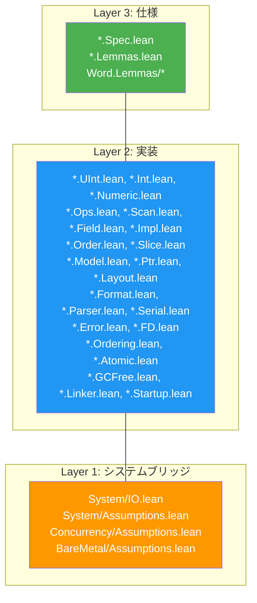

# プロジェクト構造

> **対象読者**: コントリビューター

## ディレクトリツリー

```
radix/
├── lakefile.lean              # Lake ビルド設定
├── lean-toolchain             # Lean 4 バージョンピン（v4.29.0-rc4）
├── Radix.lean                 # ルートインポート（全18 leaf modules を束ねる grouped surface）
├── CHANGELOG.md               # バージョン履歴
├── test_helpers.lean          # アドホック証明実験
│
├── Radix/                     # ソースモジュール（18 leaf modules + grouped import surfaces）
│   ├── Pure.lean              # 14 個の pure leaf modules を束ねる grouped import
│   ├── Trusted.lean           # 3 個の trusted-boundary leaf modules を束ねる grouped import
│   ├── Alignment.lean         # Alignment モジュールアグリゲータ
│   ├── Bitmap.lean            # Bitmap モジュールアグリゲータ
│   ├── CRC.lean               # CRC モジュールアグリゲータ
│   ├── DMA.lean               # DMA モジュールアグリゲータ
│   ├── ECC.lean               # ECC モジュールアグリゲータ
│   ├── MemoryPool.lean        # MemoryPool モジュールアグリゲータ
│   ├── ProofAutomation.lean   # 証明自動化 tactic マクロ
│   ├── RingBuffer.lean        # RingBuffer モジュールアグリゲータ
│   ├── Timer.lean             # Timer モジュールアグリゲータ
│   ├── UTF8.lean              # UTF-8 モジュールアグリゲータ
│   ├── Word.lean              # Word モジュールアグリゲータ
│   ├── Word/
│   │   ├── Lemmas.lean        # Word の lemma 群を束ねる aggregate import
│   │   └── ...
│   ├── Bit.lean               # Bit モジュールアグリゲータ
│   ├── Bytes.lean             # Bytes モジュールアグリゲータ
│   ├── Memory.lean            # Memory モジュールアグリゲータ
│   ├── Binary.lean            # Binary モジュールアグリゲータ
│   ├── System.lean            # System モジュールアグリゲータ
│   ├── Concurrency.lean       # Concurrency モジュールアグリゲータ
│   ├── BareMetal.lean         # BareMetal モジュールアグリゲータ
│   └── <Module>/              # モジュールごとの Spec / Impl / Lemmas / Assumptions
│
├── tests/
│   ├── Main.lean              # 実行テスト（全18 leaf modules）
│   ├── PropertyTests.lean     # プロパティベーステスト（500イテレーション、LCG PRNG）
│   ├── ComprehensiveTests.lean # アサーション集計付きの完全回帰テスト
│   └── ComprehensiveTests/    # モジュール別の包括テスト
│
├── benchmarks/
│   ├── Main.lean              # マイクロベンチマーク（10^6イテレーション、ns/op）
│   ├── baseline.c             # Cベースライン（gcc -O2 -fno-builtin）
│   └── results/
│       └── template.md        # 結果報告テンプレート
│
├── examples/
│   ├── Main.lean              # examples 実行ファイルのエントリポイント
│   └── *.lean                 # 21個の実行可能使用例
│
└── docs/                      # ユーザー向けドキュメント
    ├── en/                    # 英語ドキュメント
    └── ja/                    # 日本語ドキュメント
```

## モジュール-レイヤーマッピング



## 主要ファイル

| ファイル | 目的 |
|------|---------|
| `lakefile.lean` | ビルド設定、依存関係、ターゲット |
| `lean-toolchain` | ピン留めされたLean 4バージョン |
| `Radix.lean` | ルートインポート — 18 leaf modules 全体を束ねる grouped public surface |
| `tests/ComprehensiveTests.lean` | アサーション集計付きの完全回帰エントリポイント |
| `CHANGELOG.md` | バージョン履歴 |

## 公開 Import Surface

| Import | 対象 |
|--------|------|
| `Radix.<Module>` | `Radix.Word` や `Radix.Binary` のような単一 leaf module |
| `Radix.Pure` | Layer 2-3 に留まる 14 個の pure leaf modules |
| `Radix.Trusted` | `System`、`Concurrency`、`BareMetal` の 3 個の trusted-boundary leaf modules |
| `Radix.ProofAutomation` | メタレベルの tactic macro のみ |
| `Radix` | 完全な公開 surface |

## 命名慣習

| パターン | 意味 |
|---------|---------|
| `*.Spec.lean` | Layer 3 仕様（純粋数学、計算なし） |
| `*.Lemmas.lean` | Layer 3 証明（Layer 2 実装についての証明） |
| `*.Assumptions.lean` | Layer 1 信頼公理（`trust_*` プレフィックス） |
| `*.IO.lean` | Layer 1 システムブリッジ（Lean 4 IO APIをラップ） |
| その他の `*.lean` | Layer 2 実装 |

## リポジトリ指標

正確な行数や証明総数はリリースごとに変動します。現行の CI 出力、`lake build`、包括テストの集計結果を正式な指標として扱ってください。

## 関連ドキュメント

- [アーキテクチャ概要](../architecture/) — 3層設計
- [ビルド](build.md) — ビルドシステムの詳細
- [モジュール依存関係](../architecture/module-dependency.md) — 依存関係グラフ
