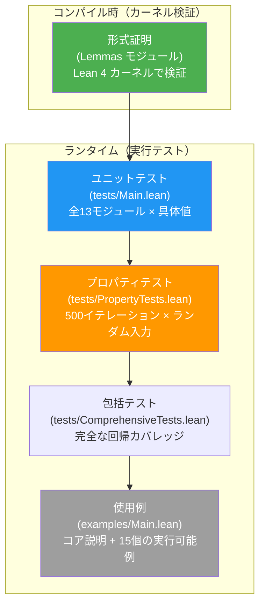

# テスト

> **対象読者**: コントリビューター

## テスト戦略

Radixは多層テスト戦略を採用：

| レイヤー | 種類 | 検証内容 |
|-------|------|-----------------|
| **形式証明** | Lean 4 型システム | 数学的正しさ（Lemmasモジュール） |
| **ユニットテスト** | `tests/Main.lean` | 全13モジュールの具体的な入出力の正しさ |
| **プロパティテスト** | `tests/PropertyTests.lean` | ランダム入力に対する代数的性質 |
| **包括テスト** | `tests/ComprehensiveTests.lean` | モジュール横断の回帰検証とアサーション集計 |
| **使用例** | `examples/Main.lean` | アサーション付きの使用例の実行 |



## テストの実行

```bash
# ユニットテスト — 全13モジュール
lake exe test

# プロパティベーステスト — ランダム + エッジケース
lake exe proptest

# 包括的な回帰テスト
lake exe comptest

# 使用例 — アサーション付き使用例
lake exe examples

# 全テスト
lake exe test && lake exe proptest && lake exe comptest && lake exe examples
```

全コマンドが失敗なしで完了するはずです。

## ユニットテスト（`tests/Main.lean`）

全13モジュールを具体的なテスト値でカバー：

| モジュール | カバレッジ |
|--------|----------|
| **Word** | 全10型（UInt8/16/32/64、Int8/16/32/64、UWord、IWord）：ラッピング、飽和、チェック付き、オーバーフロー付き算術、符号付き比較、エッジケース（0、MAX、MIN、-1） |
| **Bit** | 全10型：AND/OR/XOR/NOT、シフト、回転、clz/ctz/popcount、bitReverse、extractBits/insertBits、hammingDistance、shrArith |
| **Bytes** | bswap、BE/LE変換、ByteSlice読み書き、符号付き型変換 |
| **Memory** | Buffer zeros/read/write、チェック付きAPI、OOB処理、Ptr操作、Layout |
| **Binary** | Format DSL、Parser、Serial、ラウンドトリップ、パディング、マルチフィールドフォーマット |
| **System** | ファイル書き込み/読み取りラウンドトリップ、メタデータ、存在チェック、文字列I/O、withFileブラケット |
| **Concurrency** | オーダリング分類、妥当性、CAS、strengthen/combine、AtomicCell操作、トレース |
| **BareMetal** | プラットフォーム属性、領域、メモリマップ、スタートアップバリデーション、GCフリー、リンカー、アライメント |
| **Alignment** | `alignUp`、`alignDown`、`isAligned`、`alignPadding`、2の冪の高速パス |
| **RingBuffer** | `push`、`pop`、`peek`、`pushForce`、ラップアラウンド、FIFO保持 |
| **Bitmap** | `set`、`clear`、`test`、`toggle`、集合演算、popcount、探索 |
| **CRC** | CRC-32/CRC-16 の既知ベクタ、ストリーミング API の一貫性 |
| **MemoryPool** | Bump pool の割り当て/リセットと slab pool の割り当て/解放安全性 |

### テストパターン

各テスト関数は以下のパターンに従う：

```lean
private def testUInt8 : IO Unit := do
  IO.println "  UInt8..."
  assert ((Radix.UInt8.wrappingAdd ⟨200⟩ ⟨100⟩).toNat == 44) "UInt8 wrappingAdd"
  -- ...他のアサーション
```

失敗時は失敗したテストを識別する記述的エラーメッセージを生成。

## プロパティテスト（`tests/PropertyTests.lean`）

決定的LCG PRNG（Knuth MMIX: 乗数 = 6364136223846793005、増分 = 1442695040888963407）を使用した500イテレーションのランダムテスト。

### テスト対象の性質

**算術（全10型）:**
- 交換法則: `wrappingAdd x y = wrappingAdd y x`
- 単位元: `wrappingAdd x 0 = x`
- 逆元: `wrappingSub x x = 0`
- 自己減算: `wrappingSub x x = 0`
- 交差検証: ラッピング結果 == オーバーフロー結果（第1成分）

**飽和:**
- `saturatingAdd x 0 = x`
- `saturatingSub x 0 = x`
- 境界: `saturatingAdd x y ≥ max(x, y) ∨ saturatingAdd x y ≤ MAX`

**ビット演算（全10型）:**
- ド・モルガン: `bnot(band x y) = bor(bnot x)(bnot y)`
- 退化: `bnot(bnot x) = x`
- 自己XOR: `bxor x x = 0`
- 自己AND: `band x x = x`
- 回転/bitReverse退化
- popcount境界

**変換:**
- ゼロ拡張/トランケートラウンドトリップ
- 符号付き `toInt`/`fromInt` ラウンドトリップ

**バイトオーダー:**
- `bswap(bswap x) = x`（UInt16/32/64）
- BE/LEラウンドトリップ

**LEB128:**
- `decode(encode x) = some (x, size)`（U32/U64/S32/S64）
- サイズ上限: `encode(x).size ≤ maxSize`
- エッジケース: 0、1、MAX、2の累乗

**メモリ:**
- `Buffer.zeros n` のサイズは `n`
- チェック付き読み書きラウンドトリップ
- OOBは `none` を返す

**バイナリフォーマット:**
- 各種フォーマットのパース/シリアライズラウンドトリップ
- マルチフィールドラウンドトリップ

**システムI/O:**
- ファイル書き込み/読み取りラウンドトリップ
- ファイルメタデータの正しさ
- ファイル存在チェック

### エッジケース

全プロパティテストに網羅的なエッジケーステストを含む：
- 符号なし型: `0`、`1`、`MAX`
- 符号付き型: `0`、`1`、`-1`、`MIN`、`MAX`
- 境界算術: `MAX + 1`、`MIN - 1`、`MIN / -1`

## 形式証明

形式証明はLean 4のカーネルによりコンパイル時に検証。最も強い正しさ保証を提供：

| 証明モジュール | 性質 |
|-------------|------------|
| `Word.Lemmas.Ring` | ラッピング算術の環構造（全10型） |
| `Word.Lemmas.Overflow` | オーバーフロー検出、飽和境界、フラグ正しさ |
| `Word.Lemmas.BitVec` | `BitVec` 等価ラウンドトリップ、操作等価性 |
| `Word.Lemmas.Conv` | ゼロ拡張保存、符号拡張保存、トランケーション |
| `Bit.Lemmas` | ブール代数、ド・モルガン、シフト恒等式、フィールドラウンドトリップ |
| `Bytes.Lemmas` | bswap退化、BE/LEラウンドトリップ、ByteSlice性質 |
| `Memory.Lemmas` | バッファサイズ保存、領域分離性、アライメント |
| `Binary.Lemmas` | フォーマット性質、writePaddingサイズ、parse_padding_ok |
| `Binary.Leb128.Lemmas` | LEB128ラウンドトリップ（全4バリアント）、サイズ上限 |
| `Concurrency.Lemmas` | オーダリング証明、CAS正しさ、線形化可能性、DRF |
| `BareMetal.Lemmas` | 領域性質、スタートアップバリデーション、アライメント、GCフリー |

> **注記:** `lake build` が `sorry` ゼロで成功すれば、全証明が検証済みです。

## 新規テストの書き方

### ユニットテスト

`tests/Main.lean` に新しいテスト関数を追加：

```lean
private def testNewFeature : IO Unit := do
  IO.println "  NewFeature..."
  assert (someFunction arg == expected) "NewFeature description"
```

`main` 関数に呼び出しを追加：

```lean
def main : IO Unit := do
  -- ...既存テスト...
  testNewFeature
```

### プロパティテスト

`tests/PropertyTests.lean` に既存パターンに従って新しい性質を追加。ランダム入力生成には LCG PRNG を使用。

## 関連ドキュメント

- [ビルド](build.md) — ビルドコマンド
- [セットアップ](setup.md) — 環境構築
- [アーキテクチャ](../architecture/) — モジュール構造の理解
